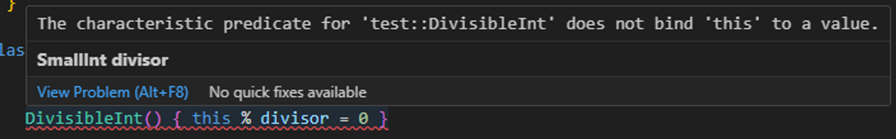

# 基础元素

- 变量(Variables)

- 类(Class)

- 表达式(Expressions)

- 查询(Queries)

- 公式(Formulas)

- 别名(Alias)

- 模块(Modules)

- 谓词(Predicates)

  

# 类(Class)

```java
class Clazz extends int {
	Clazz(){
		this=1 or this =2
	}
	
	string getString(){
		result  = "One, two" + this.toString()
    }
}

from Clazz c
select c,c.getString()
```


**codeql中的类在被调用时，其所有的子类都会被调用。**

### 类中可以包含的元素

- 特征谓词声明
- 任意数量的成员谓词声明
- 任何数量的字段声明

| 特征谓词 | 它们是在类的主体中定义的谓词。它们是使用变量 this 限制类中可能的值的逻辑属性。 |
| -------- | ------------------------------------------------------------ |
| 成员谓词 | 这些谓词只适用于特定类的成员。可以对值调用成员谓词。         |
| 字段声明 | 这些是在类的主体中声明的变量。一个类的主体中可以有任意数量的字段声明（也就是变量声明）。你可以在类内部的谓词声明中使用这些变量。和变量this一样，字段必须在特性谓词中受到约束。 |

特征谓词和成员谓词经常使用变量this。在特性谓词中，变量this约束了类中的值。在成员谓词中，this的作用与谓词的任何其他参数相同。

`c.getString()`就是上述类中的成员谓词。

```java
class SmallInt extends int {
    SmallInt() { this = [1 .. 10] }
  }
  
class DivisibleInt extends SmallInt {
    SmallInt divisor;   // declaration of the field `divisor`
    DivisibleInt() { this % divisor = 0 }
  
    SmallInt getADivisor() { result = divisor }
  }

from DivisibleInt i
select  i.getADivisor(),i
```

在这个case中，Class `DivisibleInt` 中定义了字段声明divisor，这个字段声明的约束是来自`SmallInt` 。两个类中的this都只做用于本类中。

如果将`class DivisibleInt extends SmallInt`修改成`class DivisibleInt extends int` 那么会报错。



这段函数的意思是，求1-10每一个数的因数。

### 成员谓词

如果一个类从一个超类型继承了一个成员谓词，可以覆盖继承的定义。可以通过定义一个与继承的谓词具有相同名称和奇偶性的成员谓词，并添加覆盖注解来实现。如果想完善谓词，以便为子类中的值提供一个更具体的结果。

```java
class OneTwo extends OneTwoThree {
    OneTwo() {
    this = 1 or this = 2
    }

    override string getAString() {
        result = "One or two: " + this.toString()
    }
}
class OneTwoThree extends int {
    OneTwoThree() {
    // characteristic predicate
        this = 1 or this = 2 or this = 3
    }

    string getAString() {
    // member predicate
        result = "One, two or three: " + this.toString()
    }

    predicate isEven() {
    // member predicate
        this = 1
    }
    
}

from OneTwoThree o
select o, o.getAString()
```

输出为:


### 那如果有多个子类呢？

在codeql中类在被调用时，其所有的子类都会被调用。如果有多个子类的话，那么都会被调用。

```java
class OneTwo extends OneTwoThree {
    OneTwo() {
    this = 1 or this = 2
    }

    override string getAString() {
        result = "One or two: " + this.toString()
    }
}

class TwoThree extends OneTwoThree {
    TwoThree() {
        this = 2 or this = 3
    }

    override string getAString() {
        result = "Two or three: " + this.toString()
    }
}

class OneTwoThree extends int {
    OneTwoThree() {
    // characteristic predicate
        this = 1 or this = 2 or this = 3 or this = 4
    }

    string getAString() {
    // member predicate
        result = "One, two or three: " + this.toString()
    }

    predicate isEven() {
    // member predicate
        this = 1
    }
}

from OneTwoThree x
select x, x.getAString()
```


### 多重继承

例如，使用上面的定义。

```java
class Two extends OneTwo, TwoThree {}
```

类 Two 中的任何值都必须满足 OneTwo 表示的逻辑属性和 TwoThree 表示的逻 辑属性。这里，类 Two 包含一个值，即 2。

它从 OneTwo 和 TwoThree 继承成员谓词。它还(间接)继承了 OneTwoThree 和 int。


```java
class Clazz extends int {
	Clazz(){
		this=1 or this =2
	}
	
	string getString(){
		result  = "One, two" + this.toString()
    }
}

from Clazz c
select c,c.getString()

```


**codeql中的类在被调用时，其所有的子类都会被调用。**

### 类中可以包含的元素

- 特征谓词声明
- 任意数量的成员谓词声明
- 任何数量的字段声明

| 特征谓词 | 它们是在类的主体中定义的谓词。它们是使用变量 this 限制类中可能的值的逻辑属性。 |
| --- | --- |
| 成员谓词 | 这些谓词只适用于特定类的成员。可以对值调用成员谓词。 |
| 字段声明 | 这些是在类的主体中声明的变量。一个类的主体中可以有任意数量的字段声明（也就是变量声明）。你可以在类内部的谓词声明中使用这些变量。和变量this一样，字段必须在特性谓词中受到约束。 |

特性谓词和成员谓词经常使用变量this。在特性谓词中，变量this约束了类中的值。在成员谓词中，this的作用与谓词的任何其他参数相同。

`c.getString()`就是上述类中的成员谓词。

```java
class SmallInt extends int {
    SmallInt() { this = [1 .. 10] }
  }
  
class DivisibleInt extends SmallInt {
    SmallInt divisor;   // declaration of the field `divisor`
    DivisibleInt() { this % divisor = 0 }
  
    SmallInt getADivisor() { result = divisor }
  }

from DivisibleInt i
select  i.getADivisor(),i
```

在这个case中，Class `DivisibleInt` 中定义了字段声明divisor，这个字段声明的约束是来自`SmallInt` 。两个类中的this都只做用于本类中。

如果将`class DivisibleInt extends SmallInt`修改成`class DivisibleInt extends int` 那么会报错。


这段函数的意思是，求1-10每一个数的因数。

### 重写成员谓词

如果一个类从一个超类型继承了一个成员谓词，可以覆盖继承的定义。可以通过定义一个与继承的谓词具有相同名称和奇偶性的成员谓词，并添加覆盖注解来实现。如果想完善谓词，以便为子类中的值提供一个更具体的结果。

```java
class OneTwo extends OneTwoThree {
    OneTwo() {
    this = 1 or this = 2
    }

    override string getAString() {
        result = "One or two: " + this.toString()
    }
}
class OneTwoThree extends int {
    OneTwoThree() {
    // characteristic predicate
        this = 1 or this = 2 or this = 3
    }

    string getAString() {
    // member predicate
        result = "One, two or three: " + this.toString()
    }

    predicate isEven() {
    // member predicate
        this = 1
    }
    
}

from OneTwoThree o
select o, o.getAString()
```

输出为


**那如果有多个子类呢？**

在codeql中类在被调用时，其所有的子类都会被调用。如果有多个子类的话，那么都会被调用。

```java
class OneTwo extends OneTwoThree {
    OneTwo() {
    this = 1 or this = 2
    }

    override string getAString() {
        result = "One or two: " + this.toString()
    }
}

class TwoThree extends OneTwoThree {
    TwoThree() {
        this = 2 or this = 3
    }

    override string getAString() {
        result = "Two or three: " + this.toString()
    }
}

class OneTwoThree extends int {
    OneTwoThree() {
    // characteristic predicate
        this = 1 or this = 2 or this = 3 or this = 4
    }

    string getAString() {
    // member predicate
        result = "One, two or three: " + this.toString()
    }

    predicate isEven() {
    // member predicate
        this = 1
    }
}

from OneTwoThree x
select x, x.getAString()
```


### 多重继承

例如，使用上面的定义。

```java
class Two extends OneTwo, TwoThree {}
```

类 Two 中的任何值都必须满足 OneTwo 表示的逻辑属性和 TwoThree 表示的逻 辑属性。这里，类 Two 包含一个值，即 2。

它从 OneTwo 和 TwoThree 继承成员谓词。它还(间接)继承了 OneTwoThree 和 int。


# 表达式(Expressions)

An expression evaluates to a set of values and has a type.(表达式会求值到一组值，并具有一种类型)。

**通俗的讲：表达式是代表计算逻辑，每个表达式对应可求到的一个或一组值，并且都具有特定的类型。**常量也满足表达式的定义

## 变量引用

在变量声明中，变量引用是一个声明的变量的名称。

例如，如果你声明了变量int i和LocalScopeVariable lsv，那么表达式i和lsv的类型分别为int和LocalScopeVariable。

## 字符

数字、bool值、字符串

note：在codeql中没有date，date用string表示。

## 范围

范围表达式表示两个表达式之间排序的数值范围。它由两个表达式组成，用...隔开，并用括号（[和]）括起来。例如，[3 ... 7]是一个有效的范围表达式。它的值是3和7之间的任何整数（包括3和7本身）。

在一个有效的范围中，开始和结束表达式是整数、浮点数或日期。如果其中一个是日期，那么两个都必须是日期。如果其中一个是整数，另一个是浮点数，那么两者都被视为浮点数。

## Set literal表达式(设置文本表达式)

set-literal 表达式允许明确地列出几个值之间的选择。它由一个逗号分隔的表达式集合组成，这些表达式用括号[ 和 ]括起来。例如，[2, 3, 5, 7, 11, 13, 17, 19, 23, 29]是一个有效的集合文字表达式。它的值是前十个质数。

**类似集合**

## 超级表达式(Super expressions)

当使用来自超类型的谓词定义时，如果个谓词从其超类型中继承了两个定义，谓词必须覆盖这些定义以避免歧义，或者使用超级表达式。

```java
class A extends int {
    A() { this = 1 }
    int getANumber() { result = 2 }
}

class B extends int {
    B() { this = 1 }
    int getANumber() { result = 3 }
}

class C extends A, B {
  // Need to define `int getANumber()`; otherwise it would be ambiguous
    override int getANumber() { // 最新版必须加override关键字
        result = B.super.getANumber()
    }
}

from C c
select c, c.getANumber()
```

例如这里C同时继承了A，B。A和B都是C的超类型，都定义了getANumber。在这种情况下C如果想调用其中一个的getANumber，就需要使用超级表达式`result = B.super.getANumber()`

## 谓词调用(带结果)

对有结果的谓词的调用本身就是表达式，不像对没有结果的谓词的调用是公式。

例如，a.getAChild()是对变量a的谓词getAChild()的调用，该调用的值是a的子集。

## 聚合

聚合是一种映射，它从一组由公式指定的输入值中计算出一个结果值。

语法如下：

`<aggregate>(<variable declarations> | <formula> | <expression>)`

有序聚合（即min、max、rank、concat和strictconcat）默认按照它们的值排序。排序方式可以是数字排序（对于整数和浮点数），也可以是词法排序（对于字符串）。词法排序是基于每个字符的Unicode值。

要指定不同的顺序，在`expression` 后加上关键字order by，然后是指定顺序的表达式，以及可选的关键字asc或desc（用于确定表达式是按升序还是降序排列）。如果你没有指定排序，它默认为升序。

CodeQL中的聚合有

- count
  
    count。该聚合确定了的每个可能的聚合变量赋值的不同值的数量。
    
    count(File f | f.getTotalNumberOfLines() > 500 | f)，作用是返回的是超过500行的文件数
    
- min、max
  
    min和max。这些聚合变量决定了在可能的聚合变量赋值中的最小（最小）或最大（最大）值。在这种情况下，必须是数字类型或字符串类型。
    
    max(File f | f.getExtension() = "js" | f.getBaseName() order by f.getTotalNumberOfLines())，返回行数最多的.js文件（或文件）的名称
    
    min(string s | s = "Tarski" or s = "Dedekind" or s = "De Morgan" | s)，返回三个字符串中最小的字符串s，即在所有可能的s值的词法排序中排在第一位的字符串（在本例中，它返回 "De Morgan）。
    
- avg
  
    avg：该集合确定对所有可能的集合变量分配的平均值。的类型必须是数字型。如果聚合变量没有满足公式的可能赋值，则聚合失败，不返回任何值。换句话说，它评估为空集。
    
    avg(int i | i = [0 .. 3] | i)，返回的是整数0、1、2和3的平均值。
    
- sum
  
    该集合确定值在所有可能的集合变量分配中的总和。的类型必须是数字型。如果没有满足公式的聚合变量的可能赋值，那么总和为0。
    
    sum(int i, int j | i = [0 .. 2] and j = [3 .. 5] | i * j)，该聚合返回i*j的所有可能的i和j的值之和
    
- concat
  
    该聚合将的值与所有可能的聚合变量分配相连接。注意必须是字符串类型。如果聚合变量没有满足公式的可能赋值，那么concat默认为空字符串。
    
    concat(int i | i = [0 .. 3] | i.toString() order by i desc)，该聚合返回字符串 "3210"，也就是字符串 "0"、"1"、"2 "和 "3 "的降序连接
    
    concat(int i | i = [0 .. 3] | i.toString(), "|")，该聚合返回 "0|1|2|3"。
    
- rank
  
    这个集合将的可能值进行排序。在这种情况下，必须是数字类型或字符串类型。聚合将返回排名在rank表达式指定位置的值。您必须在关键字 rank 后面的括号中包含这个 rank 表达式。
    
    rank[4](int i | i = [5 .. 15] | i)，该聚合返回在所有可能的值中排名第4的值。在这种情况下，8是5到15范围内的第4个整数。
    
    **rank下标从1开始**
    
- strictconcat、strictcount和stictsum
  
    聚合的工作原理分别和concat, count, sum一样, 但它们是严格的。也就是说，如果聚合变量没有满足公式的可能赋值，那么整个聚合就会失败，并评估为空集（而不是默认为0或空字符串）。
    
- unique
  
    取决于在所有可能的聚合变量赋值上的值。如果在聚合变量上有一个唯一的值，那么聚合体就会评估为该值。否则，聚合就没有值。
    
    from int x
    where x in [-5 .. 5] and x != 0
    
    select unique(int y | y = x or y = x.abs() | y)
    
    该查询返回正整数1，2，3，4，5。对于负整数x，表达式x和x.abs()具有不同的值，因此聚合表达式中y的值不是唯一确定的。
    

## 聚合评估(**Evaluation of aggregates**)

聚合评价的步骤为：

- 确定输入变量：这些是在`<variable declarations>`中声明的聚合变量，也是在聚合之外声明的、在聚合的某些组件中使用的变量
- 生成所有可能的输入变量值的不同元组（组合），以使`<formula>`成立。请注意，聚合变量的相同值可能出现在多个不同的元组中。在处理元组时，所有这些相同值的出现都被视为不同的出现
- 对每个元组应用<expression>并收集生成的（不同的）值。在元组上应用<expression>可能会产生多个值
- 将在步骤3生成的值应用聚合函数以计算最终结果

```java
select sum(int i, int j |exists(string s | s = "hello".charAt(i)) and exists(string s | s = "world!".charAt(j)) | i)
select count(string s | s = "hello" | s.charAt(_))
//charAt()被应用在这个元组上。s.charAt()中的下划线_是一个无所谓的表达式，它代表任何值。s.charAt(_)生成四个不同的值h、e、l、o。
```

## Any

Any表达式的一般语法与聚合的语法相似，即:

```java
any(<variable declarations> | <formula> | <expression>)
```

## 类型转化

强制转换允许您约束表达式的类型。这与其他语言中的强制转换类似，例如在 Java 中。

```java
from string s
where s = "hello".charAt(_)
select s
```


# 查询(Queries)

Queries是QL程序的输出，执行的结果集合。

有两种Queries。对于给定的查询模块，该模块中的查询是

- select 子句（如果有的话）在该模块中定义。
- 在该模块的谓词空间中的任何查询谓词，也就是说，它们可以在模块本身定义，也可以从其他模块导入

## 选择子句(Select clauses)

格式如下

```java
from /* ... variable declarations ... */
where /* ... logical formula ... */
select /* ... expressions ... */
```

还可以用其他keywords，如：

- as，as关键字，后面跟着一个名字。这给一列结果打上了 "标签"，并允许你在随后的选择表达式中使用它们。
- order by，ORDER BY关键字，后跟结果列的名称，还可以选择关键字`asc`或`desc` 。这决定了显示结果的顺序。

例如:

```java
from int x, int y
where x = 3 and y in [0 .. 2]
select x, y, x * y as product, "product: " + product
```

select clauses的返回结果为

| x    | y    | product |            |
| ---- | ---- | :------ | :--------: |
| 3    | 0    | 0       | product: 0 |
| 3    | 1    | 3       | product: 3 |
| 3    | 2    | 6       | product: 6 |

如果加上order by y desc，那么返回结果为：

| x    | y    | product |            |
| ---- | ---- | ------- | ---------- |
| 3    | 2    | 6       | product: 6 |
| 3    | 1    | 3       | product: 3 |
| 3    | 0    | 0       | product: 0 |

## 查询谓词(Query predicates)

查询谓词是带有查询注释的非成员谓词。它返回谓词评估为真的所有元组.

例如：

```java
query int getProduct(int x, int y) {
  x = 3 and
  y in [0 .. 2] and
  result = x * y
}
```

返回的结果为：

| x    | y    | result |
| ---- | ---- | ------ |
| 3    | 0    | 0      |
| 3    | 1    | 3      |
| 3    | 2    | 6      |

| x    | y    | result |
| ---- | ---- | ------ |
| 3    | 0    | 0      |
| 3    | 1    | 3      |
| 3    | 2    | 6      |

使用查询谓词而不是选择子句的一个好处是您还可以在代码的其他部分调用该谓词。例如，您可以在类的主体中调用getProduct：

```java
class MultipleOfThree extends int {
  MultipleOfThree() { this = getProduct(_, _) }
}
```

相比之下，select子句就像一个匿名谓词，因此不能以后调用它。

当您调试代码时，将查询注释添加到谓词中也会有所帮助