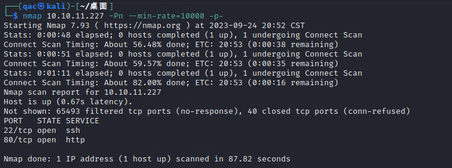

对22和80两个端口进行扫描

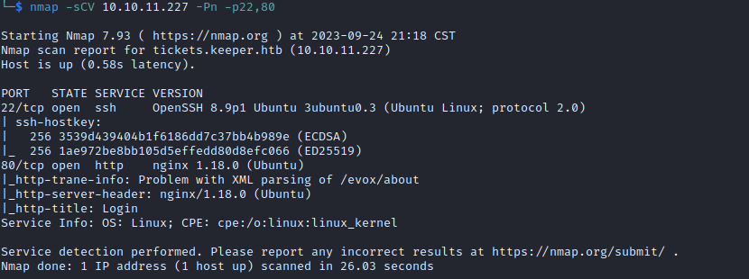

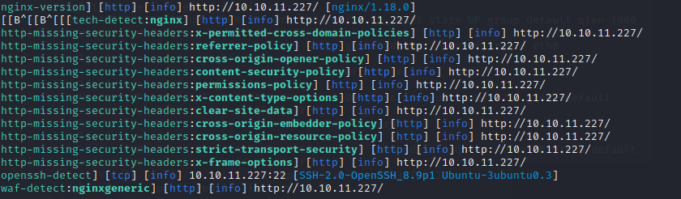

web界面为

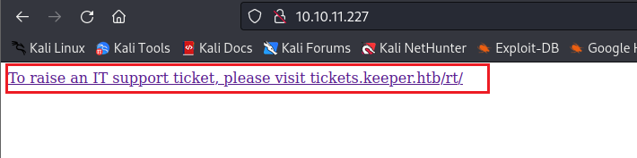

这个指向链接http://tickets.keeper.htb/rt/，但是发现访问不不了。

修改host，这样就能访问

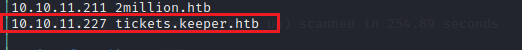

这样出现了一个login界面

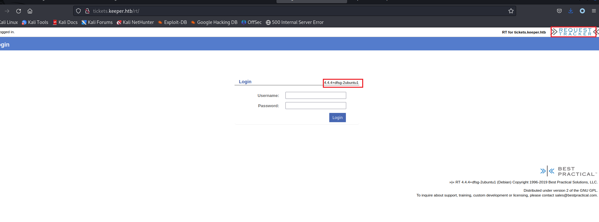

这里用到了一个request tracker的软件

**Request Tracker**，通常缩写为**RT**，是一种用Perl编写的工单跟踪事务跟踪管理系统软件，用于协调任务和管理在线用户社区之间的请求。RT 在 1996 年的第一个版本是由Jesse Vincent编写的，他后来成立了 Best Practical Solutions LLC 来分发、开发和支持该软件包。RT 是开源的，并在GNU 通用公共许可证下分发。 

可以查到有以下漏洞，看了一下都比较难利用。

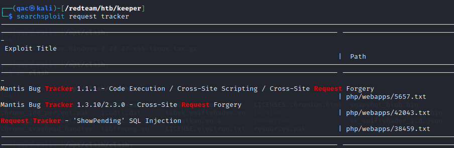

搜索Request Tracker的默认密码

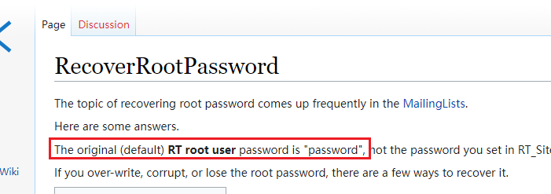

尝试root  password登录

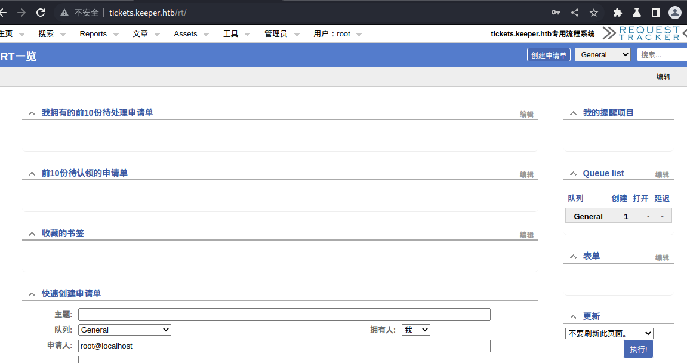

登录成功！

然后要么找用户列表 尝试ssh，要么尝试命令执行和文件上传。

先看用户列表，除了管理员还有一个lnorgaard，邮箱为	lnorgaard@keeper.htb

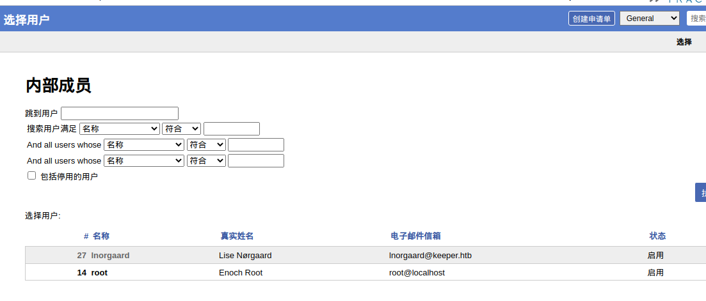

尝试ssh登录用户lnorgaard，密码使用keeper.htb，登陆失败。

点进用户的详细信息

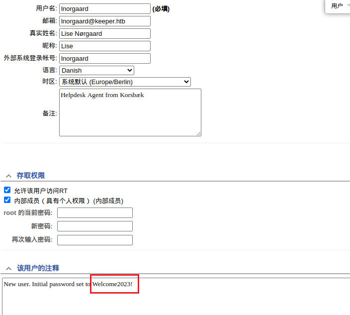

可以看到注释这里给了默认密码，使用Welcome2023!作为密码，登录成功。

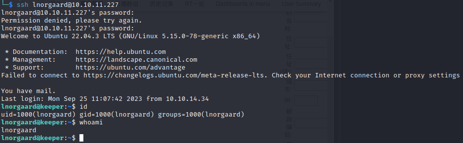
