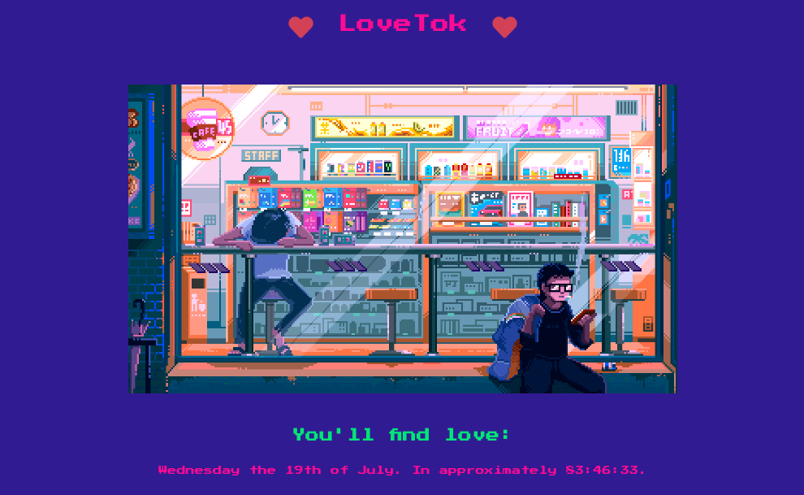

启动机器，给的IP和端口为143.110.169.131:32543

直接浏览器打开。



这个机器给了源码，下载下来看看

源码的结构为

```bash
.
├── assets
│   ├── cyberpunk.gif
│   └── favicon.png
├── controllers
│   └── TimeController.php
├── index.php
├── models
│   └── TimeModel.php
├── Router.php
├── static
│   ├── css
│   │   └── main.css
│   ├── js
│   │   ├── koulis.js
│   │   └── main.js
│   └── koulis.gif
└── views
    └── index.php
```

index.php中调用了Router，通过Router中的new函数构造TimeController中的index函数。

```php
$router = new Router();
$router->new('GET', '/', 'TimeController@index');
```

TimeController.php代码如下

```php
<?php
class TimeController
{
    public function index($router)
    {
        $format = isset($_GET['format']) ? $_GET['format'] : 'r';
        $time = new TimeModel($format);
        return $router->view('index', ['time' => $time->getTime()]);
    }
}
```

通过get请求接受format参数，并赋值给$format。如果获取不成功则默认赋值字符”r”。

然后传递给TimeModel。

TimeModel.php代码如下

```php
<?php
class TimeModel
{
    public function __construct($format)
    {
        $this->format = addslashes($format);

        [ $d, $h, $m, $s ] = [ rand(1, 6), rand(1, 23), rand(1, 59), rand(1, 69) ];
        $this->prediction = "+${d} day +${h} hour +${m} minute +${s} second";
    }

    public function getTime()
    {
        eval('$time = date("' . $this->format . '", strtotime("' . $this->prediction . '"));');
        return isset($time) ? $time : 'Something went terribly wrong';
    }
}
```

查看TimeModel.php的代码，对传入的$format使用addslashes进行转义。随后拼接到eval函数中。所以这里形成了一条污点流，source是$_GET['format']，sink是eval。

但是由于addslashes会转义双引号，因此无法直接闭合eval中的双引号，这里要想办法绕过。
