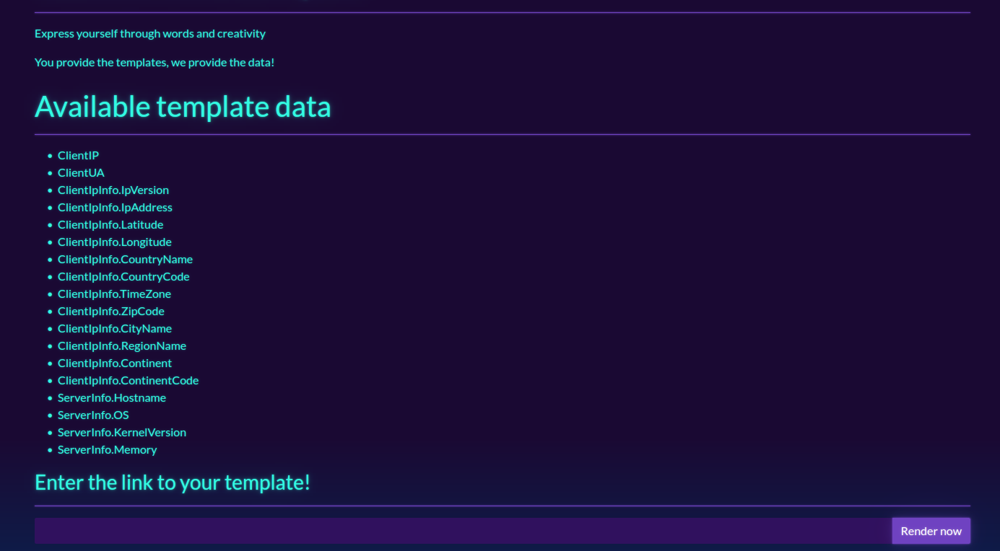
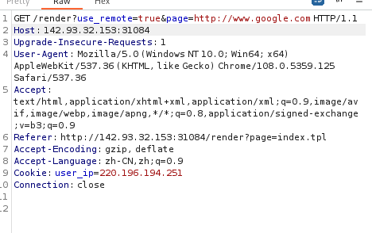
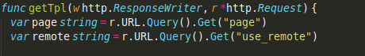
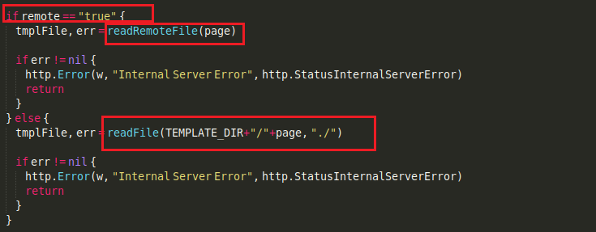
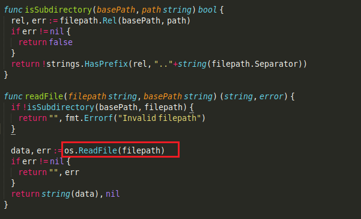

（待续）

## 知识点

SSRF

## 正文

web界面为

有一个提交窗口。

有两个参数use_remote和page。

这里存在一个SSRF，page控制的是url，use_remote是一个bool参数控制local或remote。

代码里

这里两个函数。

猜测两种方法，一个是用readRemoteFile读远程服务器上的shell。另一个是利用readFile读本地的flag。

第二个方法概率大一点。

先试一下第一个。修改page，当符合url格式时发现能访问外网如http://www.baidu.com, http://google.com。

在本地启动一个服务器，但是发现访问不到。

从第二个想法入手。查看源码。

这里使用`rel, err := filepath.Rel(basePath, path)`其中base是./，目的是限制路径为相对路径。否则可以直接通过绝对路径读到flag.txt了。

后面`return !strings.HasPrefix(rel, ".."+string(filepath.Separator))` 如果相对路径中包含`".."+string(filepath.Separator)`，则返回false，不会进入读取的步骤。

所以想办法绕过`strings.HasPrefix(rel, ".."+string(filepath.Separator))`。

