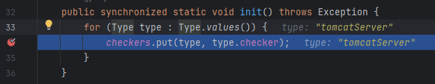
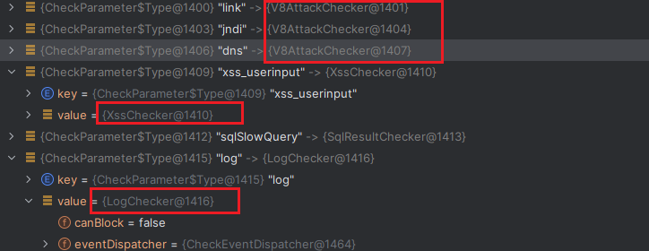
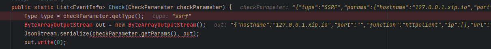

# Agent
​		入口是`com.baidu.openrasp`

```java
public static void premain(String agentArg, Instrumentation inst) {
        init(START_MODE_NORMAL, START_ACTION_INSTALL, inst);
    }
```

```java
public static void premain(String agentArg, Instrumentation inst) {
        init(START_MODE_NORMAL, START_ACTION_INSTALL, inst);
    }
```
​		在`JarFileHelper.addJarToBootstrap(inst);` 中使用`inst.appendToBootstrapClassLoaderSearch(new JarFile(localJarPath));`将本Jar文件加入jdk的根路径下。使用`appendToBootstrapClassLoaderSearch`参数后，JVM将会在启动时将指定的目录或JAR文件添加到引导类加载器的搜索路径的最后，使得引导类加载器可以加载这些额外的类和资源。这样，自定义的类或资源可以与Java平台核心类库或扩展库一起使用。

`readVersion();`从MANIFEST.MF文件中读取agent的版本信息，构建时间，git版本。

`ModuleLoader` 在静态类中初始化了 `baseDirectory`和 `moduleClassLoader`

`moduleClassLoader` 是对系统类加载器的父类进行迭代，得到的name为`sun.misc.Launcher$ExtClassLoader`的加载器。

```java
public static void premain(String agentArg, Instrumentation inst) {
        init(START_MODE_NORMAL, START_ACTION_INSTALL, inst);
    }
```


> <div class="image-with-text" style="display: flex;">      <span class="text" >sun.misc.Launcher$ExtClassLoader的作用和使用方法</span> </div>
>
> >`sun.misc.Launcher$ExtClassLoader`是Java虚拟机中的一个类加载器，它是扩展类加载器（Extension Class Loader）的具体实现。
> >
> >作为类加载器的一种，`sun.misc.Launcher$ExtClassLoader`主要用于加载Java虚拟机的扩展类库。扩展类库是指由Java虚拟机提供的，位于JRE的`lib/ext`目录下的一些核心类库和扩展功能的实现。
> >
> >扩展类加载器在Java类加载的委派模型中处于中间位置，位于应用类加载器和引导类加载器之间。当需要加载某个类时，扩展类加载器首先尝试自己去加载，如果找不到则委托给引导类加载器来加载。它负责加载`java.ext.dirs`系统属性指定的扩展类库路径下的类。
> >
> >扩展类加载器的作用包括：
> >
> >1. 加载扩展类库：它加载位于`lib/ext`目录下的类库，为Java虚拟机提供一些核心功能的扩展和补充。
> >2. 提供自定义的扩展类库：开发人员可以将自己编写的类库放置在扩展类库路径下，由扩展类加载器进行加载和管理。
> >3. 实现类加载的委派机制：扩展类加载器在加载类时会先尝试自己加载，如果找不到则委托给引导类加载器，通过这种委派机制可以保证类的唯一性和一致性。
> >
> >如果需要加载自定义的类或资源，可以使用应用类加载器或自定义的类加载器来完成。例如，可以使用`ClassLoader.getSystemClassLoader()`来获取应用类加载器，然后使用它的方法（如`loadClass()`和`getResource()`）来加载类或资源


如下为`ModuleLoader.load`的部分代码

```java
private ModuleLoader(String mode, Instrumentation inst) throws Throwable {
				...
        engineContainer = new ModuleContainer(ENGINE_JAR);
        engineContainer.start(mode, inst);
    }
```

在`ModuleContainer`的构造函数中，首先获取rasp-engine.jar 的`Manifest`文件，获取`moduleName`和`moduleEnterClassName`

```java
this.moduleName = attributes.getValue("Rasp-Module-Name");
String moduleEnterClassName = attributes.getValue("Rasp-Module-Class");
```

然后使用`ExtClassLoader`加载Rasp-Module-Class，即`com.baidu.openrasp.EngineBoot`，结果设置为modue，然后调用`module.start(mode, inst)`，即`com.baidu.openrasp.EngineBoot#start()`


# EngineBoot

`rasp-engine`启动

在`com.baidu.openrasp.EngineBoot#start()`中进行了如下操作：

- 输出banner
- 加载V8引擎,V8为native实现，具体代码在[openrasp-v8](https://github.com/baidu-security/openrasp-v8)。
- `loadConfig`加载config,比如初始化log4j的logger和为appender增加限速

```java
public static void ConfigFileAppender() throws Exception {
        DynamicConfigAppender.initLog4jLogger();
        DynamicConfigAppender.fileAppenderAddBurstFilter();
    }
```

- CheckerManager.*init*(); 用于管理 hook 点参数的检测
- initTransformer(inst); 初始化类字节码的转换器
- CloudUtils.checkCloudControlEnter()：检查云控配置信息
- LogConfig.syslogManager()：读取配置信息，初始化syslog服务连接

### 插件加载

然后JS插件初始化`JS.Initialize()`

```java
#加载插件
UpdatePlugin();
#利用文件监视器监视插件文件夹中插件的变动,插件的路径为openrasp\plugins\official
InitFileWatcher();
```

```java
UpdatePlugin:237, JS (com.baidu.openrasp.plugin.js)
UpdatePlugin:218, JS (com.baidu.openrasp.plugin.js)
Initialize:90, JS (com.baidu.openrasp.plugin.js)
start:70, EngineBoot (com.baidu.openrasp)
```

在UpdatePlugin中，通过Config中的getScriptDirectory()获取js插件目录，为apache目录下的rasp\plugins

`File pluginDir = new File(Config.getConfig().getScriptDirectory());`

通过V8引擎，将官方插件读取成JsonString的格式，利用`Config.getConfig()`

`Config.getConfig().setConfig(ConfigItem.ALGORITHM_CONFIG, jsonString, true);`

使用`item.setter.setValue(value)`将JsonSting格式插件设置到`ConfigItem.ALGORITHM_CONFIG`中

## 初始化检测器

CheckerManager.*init*();

从`com.baidu.openrasp.plugin.checker.CheckParameter.Type`中获得`(type,checker)`并且加入`CheckerManager.checker`

检测器有三种

- js插件检测
- java本地检测
- 安全基线检测

区别在于，js插件检测的checker来自于插件目录下的plugin.js，java本地检测的checker来自于源码checker/local路径下，这样做的目的是方便扩展。添加/更新插件可以直接通过修改js文件实现。插件的开发文档：[OpenRasp插件开发](https://rasp.baidu.com/doc/dev/main.html ) 

### JS插件检测

在CheckerManager初始化时，遍历`Type`类，并将其中所有的checker加入到CheckerManager的checkers中，



如下图所示，js插件的checker类都是V8AttackChecker，而java本地检测的cheker都是单独实现的类。



以ssrf为例，来看OpenRasp插件检测的流程。在plugin.js.JS的Check函数第一行下断点，然后触发SSRF。



此时堆栈如下

```
Check:161, JS (com.baidu.openrasp.plugin.js)
checkParam:50, V8AttackChecker (com.baidu.openrasp.plugin.checker.v8)
check:45, AbstractChecker (com.baidu.openrasp.plugin.checker)
check:43, CheckerManager (com.baidu.openrasp.plugin.checker)
doRealCheckWithoutRequest:304, HookHandler (com.baidu.openrasp)
doCheckWithoutRequest:361, HookHandler (com.baidu.openrasp)
doCheck:379, HookHandler (com.baidu.openrasp)
checkHttpUrl:64, AbstractSSRFHook (com.baidu.openrasp.hook.ssrf)
checkHttpUri:179, HttpClientHook (com.baidu.openrasp.hook.ssrf)
```

可以看到在进行url请求时首先触发了`HttpClientHook`，接着调用`checkHttpUrl`之后一路到

`isBlock = CheckerManager.check(type, parameter);`

通过CheckerManager根据type进一步调用了SSRF js插件的检测方法。具体的检测在JS类的Check函数中(js插件的检测都在这里触发)，涉及到V8引擎。


返回结果转码后是一个json数组，包含可信度，插件名等。

```json
[{"action":"log","message":"SSRF - Requesting known DNSLOG address: 127.0.0.1.xip.io","confidence":100,"algorithm":"ssrf_common","name":"official"}]
```


## 插桩

initTransformer(inst);

`initTransformer(inst)->transformer = CustomClassTransformer(inst)`

通过 inst.addTransformer，向 `Inst`对象注册一个 `ClassFileTransformer`即该类`CustomClassTransformer`，那么该类的transform会hook其他类捕获其他的类。

```java
public CustomClassTransformer(Instrumentation inst) {
        this.inst = inst;
        inst.addTransformer(this, true);
        addAnnotationHook();
    }
```

`transformer.retransform();`

```JAVA
//CustomClassTransformer的构造函数中啊包含addAnnotationHook
//该方法通过AnnotationScanner扫描所有hook，并加入CustomClassTransformer.hooks hashet中
private void addAnnotationHook() {
        Set<Class> classesSet = AnnotationScanner.getClassWithAnnotation(SCAN_ANNOTATION_PACKAGE, HookAnnotation.class);
        for (Class clazz : classesSet) {
            try {
                Object object = clazz.newInstance();
                if (object instanceof AbstractClassHook) {
                    addHook((AbstractClassHook) object, clazz.getName());
                }
            } catch (Exception e) {
                LogTool.error(ErrorType.HOOK_ERROR, "add hook failed: " + e.getMessage(), e);
            }
        }
    }
```

在`transform`中遍历hooks中的所有hook，判断当前类是否为hook的关注类，判断成功后交给该hook类的`transformClass`方法。

```java
for (final AbstractClassHook hook : hooks) {
    if (hook.isClassMatched(className)) {
        classfileBuffer = hook.transformClass(ctClass);}}
```


# 总结

OpenRasp通过java agent的premain 方式，**在程序执行之前加载rasp，hook住一些可能触发恶意行为的函数，通过Javaassit修改jvm中的类，然后checker进行进一步的检测**。

OpenRasp的checker主要使用js插件的方式实现，方便扩展。在openrasp\plugins\official\plugin.js中是官方实现的checker函数。可以据此参考实现自定义checker。在不方便使用V8引擎或需要深度自定义开发的情况下，可以使用java本地检测的方式实现checker。
