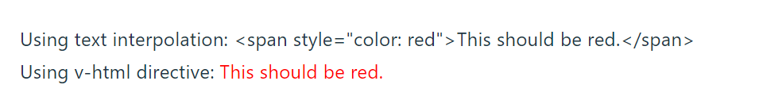

从[Vue官方文档](https://cn.vuejs.org/tutorial/#step-1)开始学习 。

```bash
project/
├── public/
│   ├── index.html
│   └── ...
├── src/
│   ├── assets/
│   │   ├── images/
│   │   └── ...
│   ├── components/
│   │   ├── Header.vue
│   │   ├── Sidebar.vue
│   │   └── ...
│   ├── views/
│   │   ├── Home.vue
│   │   ├── About.vue
│   │   └── ...
│   ├── App.vue
│   └── main.js
├── router/
│   └── index.js
├── store/
│   ├── index.js
│   ├── modules/
│   │   ├── user.js
│   │   └── ...
├── plugins/
│   └── axios.js
├── utils/
│   ├── api.js
│   └── ...
└── ...

```

这里是每个主要目录的作用：

- `public/`：包含不需要经过构建过程的静态资源，比如 `index.html`，以及其他像图片等的资源。

- `src/`：包含项目的源代码。

  - `assets/`：存放项目所需的静态资源，如图片、字体等。
  - `components/`：存放可复用的 Vue 组件，每个组件通常包含一个 `.vue` 文件，包括模板、样式和逻辑。
  - `views/`：存放页面级的 Vue 组件，每个组件对应应用中的一个页面。
  - `App.vue`：是项目的根组件，包含页面布局和路由视图的容器。
  - `main.js`：是应用的入口文件，初始化 Vue 实例并加载所需的插件和组件。

- `router/`：存放 Vue Router 相关的配置文件，例如 `index.js` 定义了路由映射关系。

- `store/`：存放 Vuex 相关的配置文件，用于管理应用的状态。`index.js` 是主入口，`modules/` 目录可以用来拆分模块化的状态管理。

- `plugins/`：存放第三方插件的配置文件，如 Axios、Vue i18n 等。

- `utils/`：存放项目的工具函数、辅助类等。

  

## 声明式渲染

[互动教程-声明式渲染](https://cn.vuejs.org/tutorial/#step-2)

**Vue 的核心功能是声明式渲染**

声明式渲染的是指，当内容改变时，HTML会自动更新。

按照给出的例子

```vue
<script setup>
import { reactive, ref } from 'vue'

const counter = reactive({ count: 0 })
const message = ref('Hello World!')
</script>

<template>
  <h1>{{ message }}</h1>
  <p>Count is: {{ counter.count }}</p>
</template>
```

这里reactive, ref用于创建响应式数据和引用数据。当count和message发生改变的时候，html也会动态的发生变化。这里可以直接修改查看变化。

这个例子提供了一个按钮用来增加counter.count。 

```vue
<script setup>
import { reactive } from 'vue'

const counter = reactive({ count: 0 })

// 定义一个函数来增加 count
const incrementCount = () => {
  counter.count++
}
</script>

<template>
  <div>
    <button @click="incrementCount">增加 Count</button>
    <p>Count is: {{ counter.count }}</p>
  </div>
</template>
```


## Attribute 绑定

- 在 Vue 中，mustache 语法 (即双大括号) 只能用于文本插值。

- 如果要插入HTML，那么需要使用`v-html`指令。

​	例如：

```html
<p>Using text interpolation: {{ rawHtml }}</p>
<p>Using v-html directive: <span v-html="rawHtml"></span></p>
```




- 为了给 attribute 绑定一个动态值，需要使用 `v-bind` 指令：

​	v-bind的指令用法如下，也可以使用简写`:class=titleClass`

```vue
<script setup>
import { ref } from 'vue'

const titleClass = ref('title')
</script>

<template>
  <h1 v-bind:class=titleClass >Make me red</h1> <!-- 此处添加一个动态 class 绑定 -->
</template>

<style>
.title {
  color: red;
}
</style>
```


## 事件监听

`v-on` 指令可以监听DOM事件，简写为`@`

例子如下：

```vue
<script setup>
import { ref } from 'vue'

const count = ref(0)

function increment() {
  count.value++
}
</script>

<template>
  <button @click="increment">count is: {{ count }}</button>
</template>
```


## 表单绑定

同时使用 `v-bind` 和 `v-on` 来在表单的输入元素上创建双向绑定

```vue
<input :value="text" @input="onInput">
```

```js
function onInput(e) {
  // v-on 处理函数会接收原生 DOM 事件
  // 作为其参数。
  text.value = e.target.value
}
```

为了简化双向绑定，Vue 提供了一个 `v-model` 指令，它实际上是上述操作的语法糖：

```vue
<input v-model="text">
```


例子：

```vue
<script setup>
import { ref } from 'vue'

const text1 = ref('')
</script>

<template>
  <input v-model="text1" placeholder="Type here">
  <p>{{ text1 }}</p>
</template>
```

v-model自动将被绑定的值，也就是const text1和`<input>`的值同步。多选框、单选框、下拉框等也支持 `v-model`。

例如

```vue
<div>Picked: {{ picked }}</div>

<input type="radio" id="one" value="One" v-model="picked" />
<label for="one">One</label>

<input type="radio" id="two" value="Two" v-model="picked" />
<label for="two">Two</label>
```


## 条件渲染

`v-if`指令用来有条件的渲染元素

```vue
<h1 v-if="awesome">Vue is awesome!</h1>
```

这个 `<h1>` 标签只会在 `awesome` 的值为true时渲染。若 `awesome` 更改为flase，它将被从 DOM 中移除。

`v-else` 和 `v-else-if` 可以表示其他的条件分支，例子：

```vue
<script setup>
import { ref } from 'vue'

const awesome = ref(true)

function toggle() {
  awesome.value = !awesome.value
}
</script>

<template>
  <button @click="toggle">toggle</button>
  <h1 v-if="awesome">Vue is awesome!</h1>
  <h1 v-else>Oh no 😢</h1>
</template>
```


## 列表渲染

我们可以使用 `v-for` 指令来渲染一个基于源数组的列表：

```vue
<ul>
  <li v-for="todo in todos" :key="todo.id">
    {{ todo.text }}
  </li>
</ul>
```

在 `v-for` 块中可以完整地访问父作用域内的属性和变量。`v-for` 也支持使用可选的第二个参数表示当前项的位置索引。

```vue
const parentMessage = ref('Parent')
const items = ref([{ message: 'Foo' }, { message: 'Bar' }])


<li v-for="(item, index) in items">
  {{ parentMessage }} - {{ index }} - {{ item.message }}
</li>
```


如果需要在数组上添加元素，可以使用

`todos.value.push(newTodo)`

使用新的数组替换原数组，可以用来实现删除元素：

`todos.value = todos.value.filter(*/\* ... \*/*)`

例子：

```vue
<script setup>
import { ref } from 'vue'

// 给每个 todo 对象一个唯一的 id
let id = 0

const newTodo = ref('')
const todos = ref([
  { id: id++, text: 'Learn HTML' },
  { id: id++, text: 'Learn JavaScript' },
  { id: id++, text: 'Learn Vue' }
])

function addTodo() {
  todos.value.push({ id: id++, text: newTodo.value })
  newTodo.value = ''
}

function removeTodo(todo) {
  todos.value = todos.value.filter((t) => t !== todo)
}
</script>

<template>
  <form @submit.prevent="addTodo">
    <input v-model="newTodo">
    <button>Add Todo</button>    
  </form>
  <ul>
    <li v-for="todo in todos" :key="todo.id">
      {{ todo.text }}
      <button @click="removeTodo(todo)">X</button>
    </li>
  </ul>
</template>
```


这里filter的作用是遍历数组，对每个元素执行后面的函数。当元素与传入的 `todo` 不相等时，条件判断为真，这个元素会被保留在结果数组中。当元素与传入的 `todo` 相等时，条件判断为假，这个元素会被过滤掉，从而不会出现在结果数组中。


## 计算属性


```vue
<script setup>
import { ref, computed } from 'vue'

let id = 0

const newTodo = ref('')
const hideCompleted = ref(false)
const todos = ref([
  { id: id++, text: 'Learn HTML', done: true },
  { id: id++, text: 'Learn JavaScript', done: true },
  { id: id++, text: 'Learn Vue', done: false }
])

const filteredTodos = computed(() => {
  return hideCompleted.value
    ? todos.value.filter((t) => !t.done)
    : todos.value
})

function addTodo() {
  todos.value.push({ id: id++, text: newTodo.value, done: false })
  newTodo.value = ''
}

function removeTodo(todo) {
  todos.value = todos.value.filter((t) => t !== todo)
}
</script>

<template>
  <form @submit.prevent="addTodo">
    <input v-model="newTodo">
    <button>Add Todo</button>
  </form>
  <ul>
    <li v-for="todo in filteredTodos" :key="todo.id">
      <input type="checkbox" v-model="todo.done">
      <span :class="{ done: todo.done }">{{ todo.text }}</span>
      <button @click="removeTodo(todo)">X</button>
    </li>
  </ul>
  <button @click="hideCompleted = !hideCompleted">
    {{ hideCompleted ? 'Show all' : 'Hide completed' }}
  </button>
</template>

<style>
.done {
  text-decoration: line-through;
}
</style>
```


`@submit.prevent="addTodo"`  @submit监听了表单提交事件，属性.prevent用于阻止浏览器默认的表单提交行为。

@submit还有多个属性，并且可以组合多个修饰符。

- **.prevent** 阻止默认的表单提交行为，常用于防止页面刷新或页面跳转。
- **.stop** 阻止事件冒泡，这可以防止事件在嵌套的元素中传递。
- **.once** 只触发一次事件处理程序，防止处理程序多次触发。
- **.capture** 在捕获阶段触发事件处理程序，而不是在冒泡阶段。
- **.self** 只有事件是由元素自身触发时才会触发事件处理程序，不会由子元素触发。

重点看一下

```vue
const filteredTodos = computed(() => {
  return hideCompleted.value
    ? todos.value.filter((t) => !t.done)
    : todos.value
})
```

这里根据hideCompleted.value的值确定返回结果，如果是true，那么就不返回已经完成的选项。


## 生命周期和模板引用

目前为止，Vue 为我们处理了所有的 DOM 更新，这要归功于响应性和声明式渲染。然而，有时我们也会不可避免地需要手动操作 DOM。

这时我们需要使用**模板引用**——也就是指向模板中一个 DOM 元素的 ref。我们需要通过这个特殊的 `ref` attribute来实现模板引用。

```vue
<script setup>
import { ref, onMounted } from 'vue'

const pElementRef = ref(null)

onMounted(() => {
  pElementRef.value.textContent = 'mounted!'
})
</script>

<template>
  <p ref="pElementRef">hello</p>
</template>
```

注意这个 ref 使用 `null` 值来初始化。这是因为当 `<script setup>` 执行时，DOM 元素还不存在。模板引用 ref 只能在组件**挂载**后访问。

**Vue 3 生命周期钩子函数：**

1. `onBeforeCreate`：在组件实例初始化之后，数据观测 (data observation) 和 event/watcher 事件配置之前被调用。对应 Vue 2.x 的 `beforeCreate` 钩子。
2. `onCreated`：在组件实例创建完成后立即被调用。对应 Vue 2.x 的 `created` 钩子。
3. `onBeforeMount`：在挂载开始之前被调用。对应 Vue 2.x 的 `beforeMount` 钩子。
4. `onMounted`：在挂载结束后被调用。对应 Vue 2.x 的 `mounted` 钩子。
5. `onBeforeUpdate`：在数据更新之前被调用，发生在虚拟 DOM 重新渲染和打补丁之前。对应 Vue 2.x 的 `beforeUpdate` 钩子。
6. `onUpdated`：在数据更新后被调用，发生在虚拟 DOM 重新渲染和打补丁之后。对应 Vue 2.x 的 `updated` 钩子。
7. `onBeforeUnmount`：在卸载之前被调用。对应 Vue 2.x 的 `beforeDestroy` 钩子。
8. `onUnmounted`：在卸载完成后被调用。对应 Vue 2.x 的 `destroyed` 钩子。
9. `onErrorCaptured`：在捕获一个来自子孙组件的异常时被调用。对应 Vue 2.x 的 `errorCaptured` 钩子。
10. `onRenderTracked`：在一个渲染函数被追踪时被调用。这是一个 Vue 3 新增的钩子，用于追踪渲染函数的依赖。
11. `onRenderTriggered`：在一个渲染函数触发更新时被调用。这也是 Vue 3 新增的钩子，用于追踪渲染函数的更新。


## 侦听器

当被监听的对象放生改变时，触发预定义的行为。


```js
import { ref, watch } from 'vue'

const count = ref(0)

watch(count, (newCount) => {

  console.log(`new count is: ${newCount}`)
})
```

newcount是改变后的值。


## Props(父组件传值给子组件)

 子组件可以通过 **props** 从父组件接受动态数据。首先，需要声明它所接受的 props：


```vue
<!--ChildComp-->
<script setup>
const props = defineProps({
  msg: String
})
</script>

<template>
  <h2>{{ msg || 'No props passed yet' }}</h2>
</template>
```


```vue
<!--App.vue-->
<script setup>
import { ref } from 'vue'
import ChildComp from './ChildComp.vue'

const greeting = ref('Hello from parent')
</script>

<template>
  <ChildComp :msg="greeting" />
</template>

```


## Emits(子组件向父组件触发事件)

```vue
<!--ChildComp-->
<script setup>
const emit = defineEmits(['response'])

emit('response', 'hello from child')
</script>

<template>
  <h2>Child component</h2>
</template>
```


```vue
<!--App.vue-->
<script setup>
import { ref } from 'vue'
import ChildComp from './ChildComp.vue'

const childMsg = ref('No child msg yet')
</script>

<template>
  <ChildComp @response="(msg) => childMsg = msg" />
  <p>{{ childMsg }}</p>
</template>
```


## 插槽

在子组件中，可以使用 `<slot>` 元素作为插槽出口 (slot outlet) 渲染父组件中的插槽内容 (slot content)：
