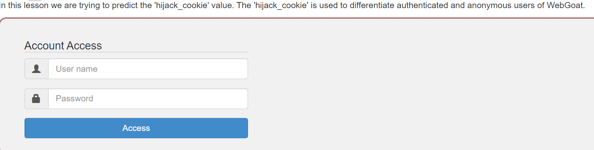
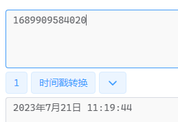
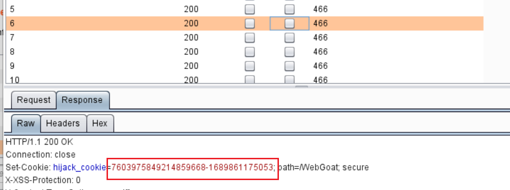
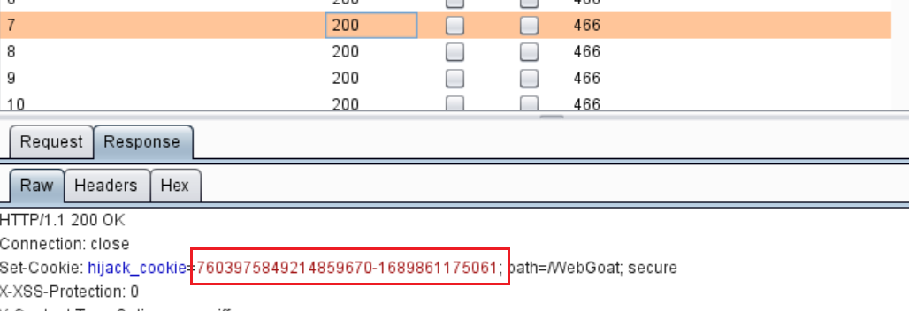
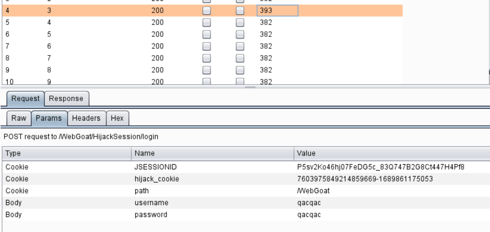

## 简介

WebGoat是一个java-based的靶场。

通过该靶场可以学习相关漏洞原理，测试相关扫描器。


## 安装

方便分析源码所以直接下载源码，`git clone  https://github.com/WebGoat/WebGoat.git`

在启动项目之前修改服务的地址，因为原来设置的是127.0.0.1，导致启动后只能用127.0.0.1访问，本地地址无法访问，这样用bp抓包时比较麻烦。因此这里修改成0.0.0.0。路径为：

`WebGoat/webgoat-container/src/main/resources/application.properties`

```bash
server.address=${webgoat.host}
webgoat.host=${WEBGOAT_HOST:0.0.0.0}
```

启动webgoat。

```Shell
java -jar target/webgoat-2023.3-SNAPSHOT.jar
```

## Hijack a session

这个练习是让我们通过session登录到其他用户的登录态。首先在Account Access处尝试登录，利用burp抓包分析登录的整个过程。



在登录的返回包中有字段

`Set-Cookie: hijack_cookie=5504664171286801298-1689909584020; path=/WebGoat; secure`

`hijack_cookie`由两个部分组成，后部分看着像是时间戳，转换以下发现果然。



前面的数字串不知道是什么，多发几个包看看。发现前面的数字串每次发包都会增加1，说明可能是什么id。在查看时发现有部分id被跳过了，说明可能是有其他用户在登录，那个id被分配个该用户。如下图第6和第7个包id的末尾分别为68和70。说明69是其他用户，抓包然后修改时间进行fuzz，时间在两个包的时间戳之间。








发现有一个包长度不一样，打开发现返回登录成功。




此时回到界面，已经是完成状态了。


