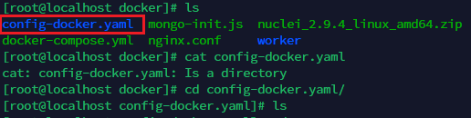

###  1.使用Docker-compose.yml指定本地的Dockerfile时路径问题

在Project项目下有如下内容。

```bash
#Project
.
├── src
├── docker
│   ├── worker
│   │   ├── Dockerfile
	├── docker-compose.yml

```

在构造docker-compose.yml的时候，其中build设置如下。

context是上下文路径，之所以设置为项目的根目录，是因为在Dockerfile中存在COPY等命令，依赖于项目中所有的文件。如果上下文只在docker中，那么src/中的源代码在构建docker时候就无法使用。

```
build:
  context: ../../Project
  dockerfile: docker/worker/Dockerfile
```

### 2.ERRORS：flags: 0x5000: not a directory

在我的docker-compose.yml中，存在如下设置

```yaml
    volumes:
      - ./config-docker.yaml:/code/app/config.yaml
```

将本地的config-docker.yaml和容器内的config.yaml进行关联。执行时候报错：

```bash
ERRORS：flags: 0x5000: not a directory: unknown: Are you trying to mount a directory onto a file (or vice-versa)? Check if the specified hoRecreating 39cef2ea8038_web ... error
```

经过查询，发现是在执行容器构建的时候本地路径下不存在./config-docker.yaml文件，于是docker自动在指定路径创建了一个config-docker.yaml，但是是文件夹。所以没法进行关联。



解决办法：进行关联之前先创建好对应的文件夹。
