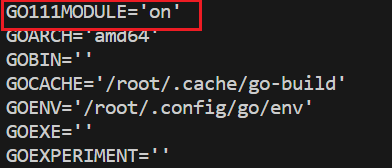

 

参考资料：[***Build Web Application with Golang\***](https://astaxie.gitbooks.io/build-web-application-with-golang/content/en/)

## 开发环境

vscode + go1.21.5 +wsl Ubuntu20.04


go项目结构分为GoPath和GoModules两种。

### GoPath

在GoPath模式下，所有和go项目相关的文件都在环境变量$GOPATH指向的路径下。在该路径下存在三个子路径：

```bash
$GOPATH
├── src/ for source files whose suffix is .go, .c, .g, .s.
├── pkg/ for compiled files whose suffix is .a.
└── bin/ for executable files
```

src存放所有的 Go 源代码文件，pkg存放编译后的库文件(`.a` 文件)，bin存放可执行文件。

这样导致的问题就是文件结构不自由并且多个项目的依赖管理困难。

注：$GOROOT和$GOPATH的区别，$GOPATH是go项目相关，$GOROOT则是Go的安装路径。


### GoModules

在 go1.11后推出了GoModules 模式，GoModules 模式主要依赖于官方发布了自己的包管理工具，即 mod。GO111MODULE默认为空，此时为auto模式。在auto模式下如果项目下存在 go.mod 文件时，就启用 GoModules 模式。如果手动设置为on则忽略$GOPATH文件夹。




手动设置的命令为

```bash
go env -w GO111MODULE=on
```


## 项目结构

在空文件夹下执行`go init test/mymath`，会生成一个go.mod文件。该文件用于包管理。随后新建两个go文件main.go和sqrt.go

```go
//main.go
package main

import (
	"fmt"
)

func main() {
	fmt.Printf("Hello,world.Sqrt(2)=%v", Sqrt(2.0))
}

//sqrt.go
package main

func Sqrt(x float64) float64 {

	z := 0.0
	for i := 0; i < 1000; i++ {
		z -= (z*z - x) / (2 * x)
	}
	return z

}

```

此时结构如下：

```bash
.
├── go.mod
├── main.go
└── sqrt.go
```

在go项目中main包中的main函数是程序入口。同一路径下的文件从属于同一个包，可以直接相互调用，否则需要引入包。


但是在该例子中，直接运行`go run main.go `会报错`./main.go:8:39: undefined: Sqrt`。这是由于如果编译的包名是main包，系统不会自动编译引用的*同一包*的相关*文件*，此时会报错：xxx变量undefined；xxx函数undefined。

```markdown
Each go file is in some package, and that package should be a distinct folder in the GOPATH, but main is a special package which doesn't require a main folder. This is one aspect which they left out for standardization! But should you choose to make a main folder then you have to ensure that you run the binary properly. Also one go code can't have more than one main go file.
```


可以使用命令`go run *.go`。


## 语法相关

- Go 使用 UTF-8 字符集。字符串由双引号 "" 或反引号 \`\` 表示。但是双引号""不能跨行，反引号\`\`则可以，且不会转义任何字符。

- 在go中动态数组被称为slice。定义方式和数组一样，不指定具体的长度就可以了。

- 可变参函数

  ```Go
  func myfunc(arg ...int) {
      for _, n := range arg {
      fmt.Printf("And the number is: %d\n", n)
  }
  }
  ```

- **defer**的用法，defer在函数执行完后开始从后往前执行，适用于一些结束的工作

  ```Go
  func ReadWrite() bool {
      file.Open("file")
      // Do some work
      if failureX {
          file.Close()
          return false
      }
  
      if failureY {
          file.Close()
          return false
      }
  
      file.Close()
      return true
  }
  
  //defer改写
  func ReadWrite() bool {
      file.Open("file")
      defer file.Close()
      if failureX {
          return false
      }
      if failureY {
          return false
      }
      return true
  }
  ```

- 导包的时候 _ 运算符实际上意味着我们只想导入该包并执行其 init 函数，不确定是否要使用属于该包的函数。

  ```Go
  import (
   "database/sql"
   _ "github.com/ziutek/mymysql/godrv"
  )
  ```


### interface相关

在go中interface有以下作用：

- 使用同一个interface将不同的struct存在同一个slice中，slice的类型为interface。

- fmt的源码

  ```Go
  type Stringer interface {
      String() string
  }
  ```

​		因此只要实现了fmt.Stringer，就可以直接通过fmt.Println输出。

 ```go
  package main
  
  import (
      "fmt"
      "strconv"
  )
  
  type Human struct {
      name  string
      age   int
      phone string
  }
  
  // Human implements fmt.Stringer
  func (h Human) String() string {
      return "Name:" + h.name + ", Age:" + strconv.Itoa(h.age) + " years, Contact:" + h.phone
  }
  
  func main() {
      Bob := Human{"Bob", 39, "000-7777-XXX"}
      fmt.Println("This Human is : ", Bob)
  }
 ```

- 空接口

  空接口可以存任意类型的值
  
  ```Go
  // define a as empty interface
  var void interface{}
  
  // vars
  i := 5
  s := "Hello world"
  
  // a can store value of any type
  void = i
  void = s
  ```
  
  
