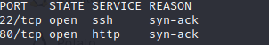
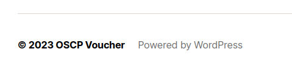
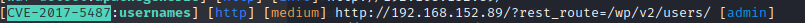
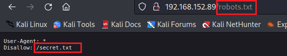
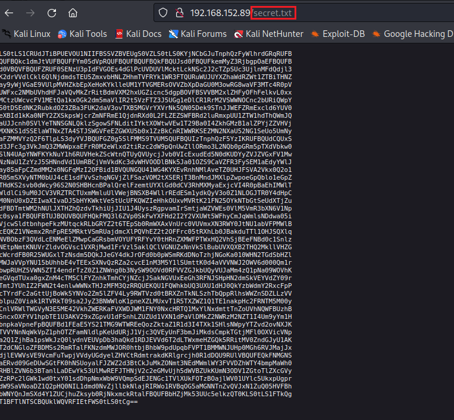
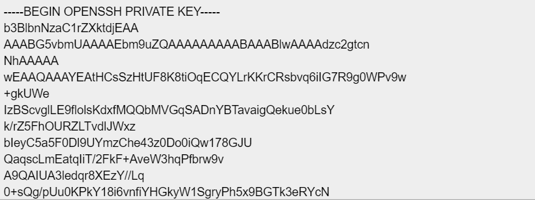
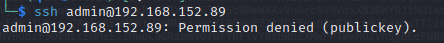
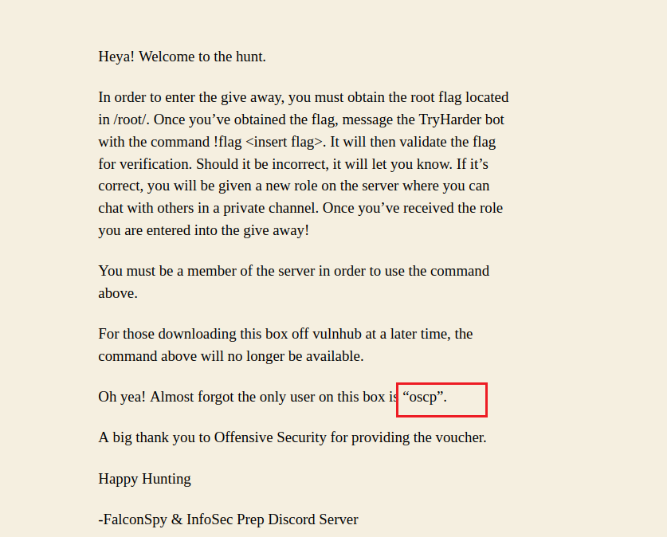
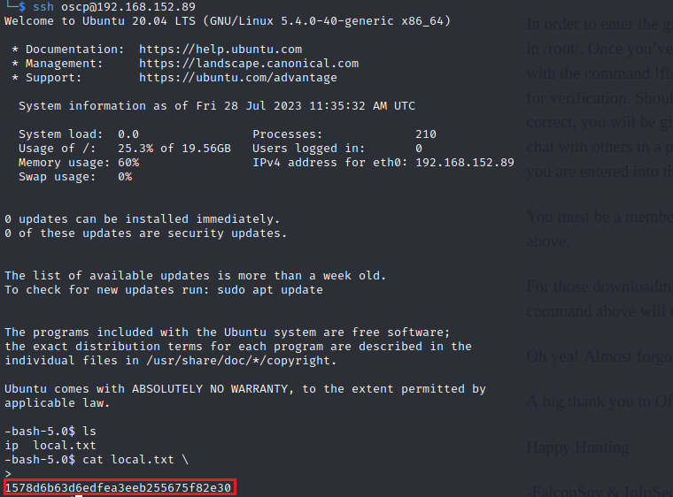

首先端口扫描

`nmap -sT 192.168.152.89 -p- -Pn --min-rate=10000 -vv` 

得到结果

访问web服务

看到**WordPress**，直接wpscan开扫。这里能得到用户名**admin**。

利用CVE-2017-5487也能得到。

路径扫描发现存在robots.txt

访问secret.txt。

base64解码下

openssh private key。 复制下来保存到`~/.ssh/id_rsa`中。

然后直接用ssh连接，用户名不是admin。

回去找了找，在主页发现用户名oscp。

重新登陆成功。

得到user flag。

