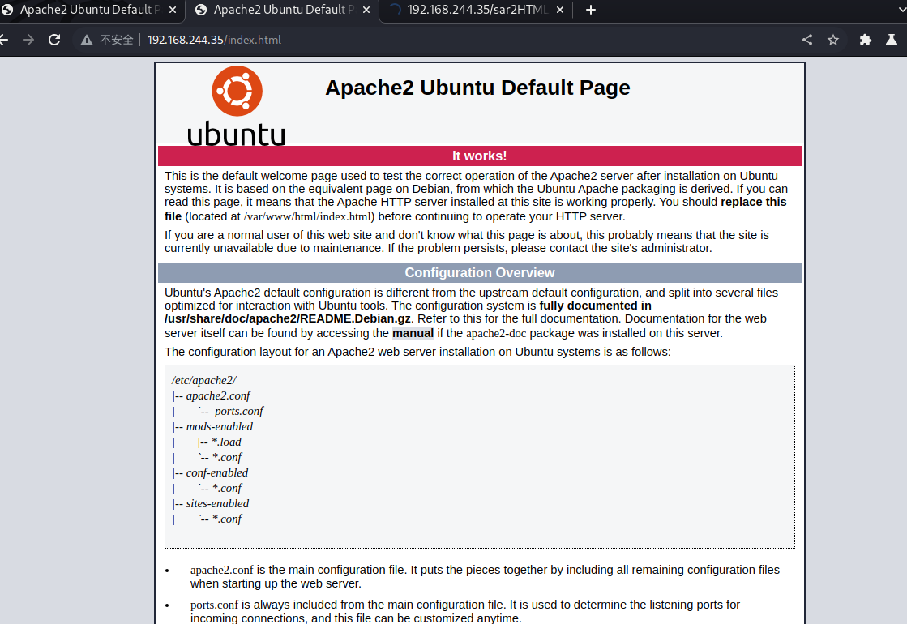
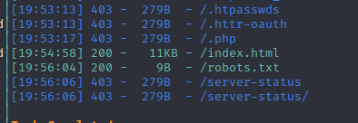
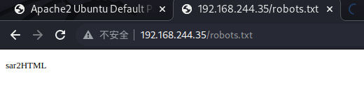
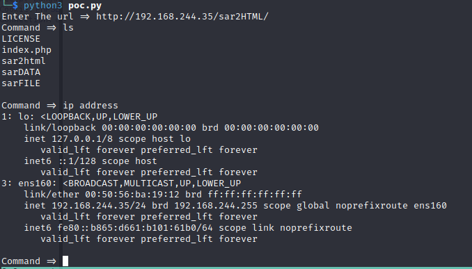
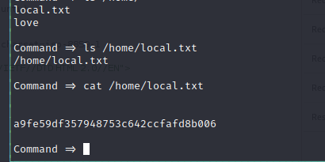
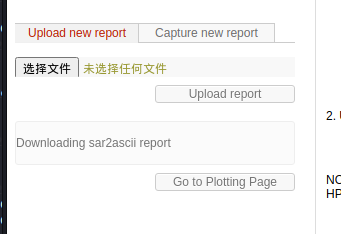
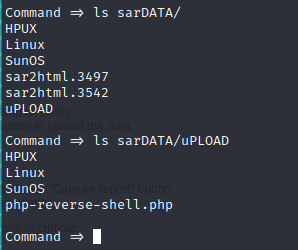

## 知识点

## 正文

主页如下

路径扫描扫到robots.txt

然后发现存在sar2HTML 。

`sar2HTML` 是一个用于将 Linux 系统性能监控数据（通过 `sar` 命令收集的）转换为可视化的HTML报告的工具。它提供了一个直观的界面，以便用户可以更容易地分析和理解系统的性能表现。

搜索发现存在exp，[sar2html 3.2.1 - 'plot' Remote Code Execution](https://www.exploit-db.com/exploits/49344)

直接执行poc

但是这里尝试后发现没办法反弹shell

### 利用php shell反弹shell

在这了发现php可以正常上传，那么可以这里上传，通过刚才的命令行得到上传shenll 的路径。

看到路径为,http://ip/sar2HTML/sarDATA/uPLOAD/php-reverse-shell.php

在本地监听，访问该shell后反弹成功。
