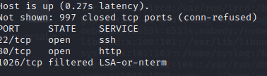
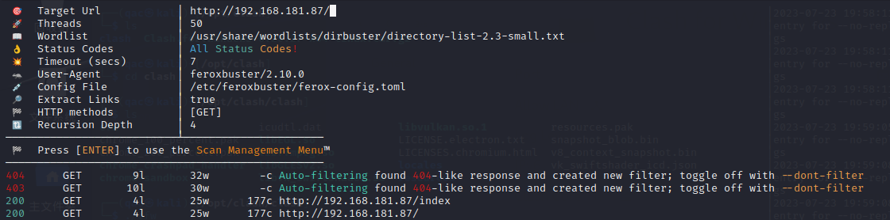
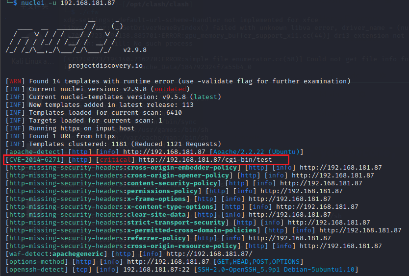
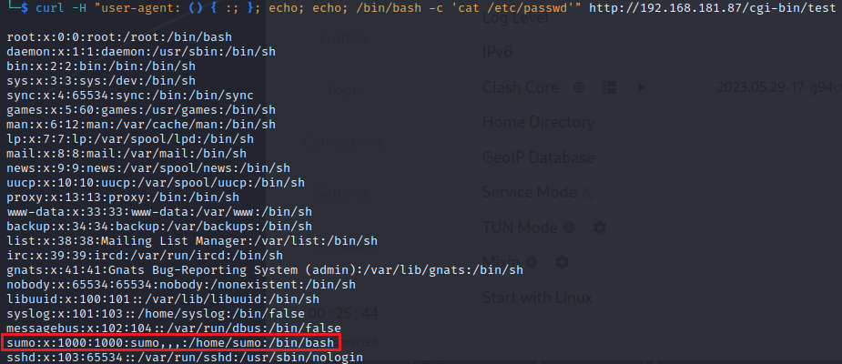
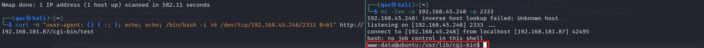
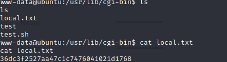
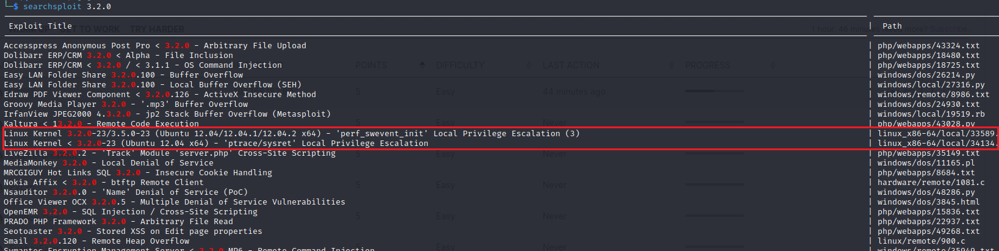

首先进行端口扫描

路径扫描

`feroxbuster -u http://192.168.181.87/ -w /usr/share/wordlists/dirbuster/directory-list-2.3-small.txt`  

没扫到东西。然后试试用nuclei扫描。

扫到一个EXP： https://github.com/opsxcq/exploit-CVE-2014-6271，试了一下发现可以直接利用

尝试反弹shell，反弹成功。

直接拿到用户flag

## 提权

SUID、定时任务，sudo都没有找到利用方法。看内核时Linux3.2.0，搜索是否存在内核提权。

![image-20230723203927961](../images/offsec-Lab-Sumo/image-20230723203927961.png

